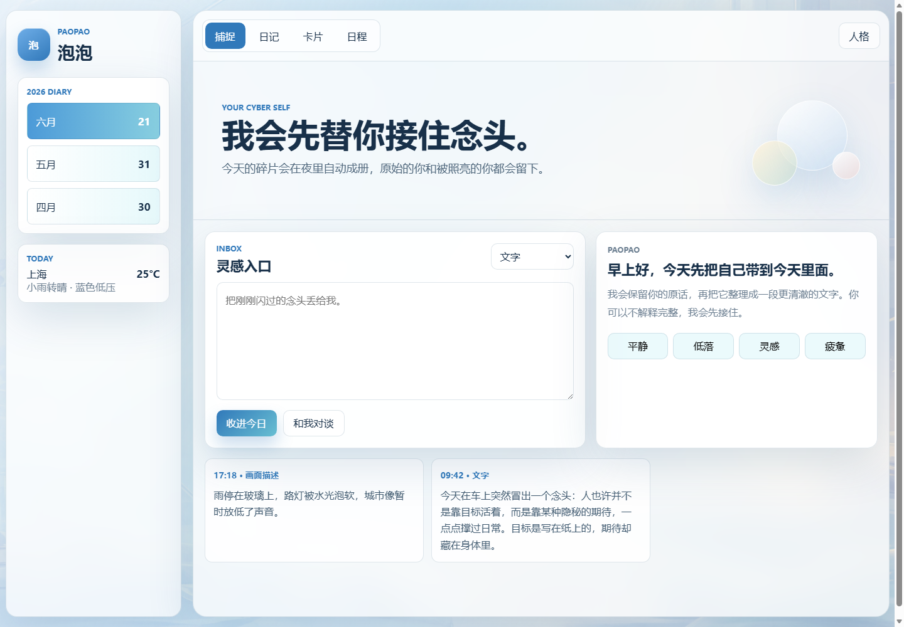
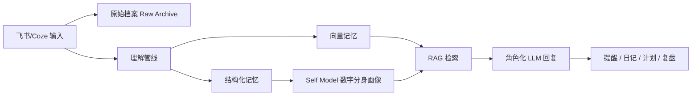
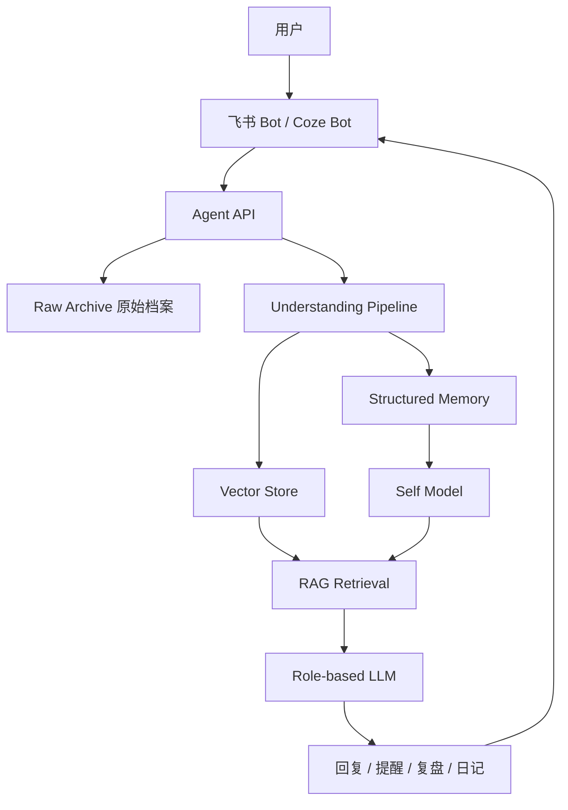

# Paopao 泡泡｜Coze AI 数字分身 Agent

> 一个面向个人长期成长的 AI 数字分身：记录真实世界中的用户，形成长期记忆与自我模型，并通过飞书/Coze 工作流主动提醒、鼓励与牵引用户行动。



## 项目定位

泡泡不是普通日记产品，也不是单纯的心理陪伴机器人。

它是一个 **AI 数字分身 / 自我指引型 Agent**：用户可以把文字、语音、图片、链接、计划、欲望、日程、地点、旅行、阅读和社交观察持续发送给泡泡；泡泡通过长期记忆与 RAG 检索逐渐理解用户，形成一个更清醒、更高效、更积极的“数字超我”。

项目核心问题：

- 用户每天产生大量碎片化想法、欲望、计划和外部信息，但缺少统一沉淀系统。
- 传统日记偏被动记录，无法主动理解用户的长期目标和行为模式。
- 普通 AI Chatbot 缺少长期记忆，不能随用户持续进化。
- AI 分身产品如果只做人设聊天，很难真正连接用户现实生活。

泡泡试图探索一种新的 AI 分身形态：

> **从“会聊天的角色”升级为“懂我的长期记忆系统 + 主动成长教练 + 现实世界连接器”。**

## 为什么适合 AI 分身岗位

这个项目围绕 AI 分身作者端与互动容器的关键问题展开：

- **用户理解**：从人格标签转向用户真实欲望、目标、行为和成长路径。
- **多模态融合**：规划接入文字、语音、图片、链接、文件、地点和日程。
- **角色化 LLM**：通过自我模型、理想自我素材库、语气边界和系统提示词生成稳定人格。
- **长期记忆 / RAG**：设计原始档案、结构化记忆、向量记忆和自我画像四层记忆系统。
- **社交与互动场景**：以飞书机器人作为实时入口，后续可迁移到 Coze Bot、抖音私信、互动作品或 AI 分身作者端。
- **产品落地意识**：包含 PRD、Workflow、Prompt、指标体系、Feishu Bot MVP 和 Web 原型。

## Demo 与链接

- Web 原型：[`prototype/index.html`](./prototype/index.html)
- 飞书机器人骨架：[`feishu-bot/`](./feishu-bot/)
- 产品架构文档：[`docs/product-architecture.md`](./docs/product-architecture.md)
- Coze 工作流设计：[`docs/coze-workflow.md`](./docs/coze-workflow.md)
- 系统提示词设计：[`docs/prompt-design.md`](./docs/prompt-design.md)
- 简历项目描述：[`docs/resume-snippets.md`](./docs/resume-snippets.md)

> 如果部署 GitHub Pages，项目展示页可作为线上简历的“项目链接”使用。

## 核心体验

### 1. 随时捕捉

用户像给朋友发消息一样把任何材料发给泡泡：

- 一句话灵感
- 语音想法
- 图片/截图/手绘
- 网页或视频链接
- 日程变化
- 读书笔记
- 旅行记录
- 人物观察
- 赚钱想法
- 欲望和计划

泡泡同时做两件事：

- 保留原始输入，不覆盖用户最初表达。
- 抽取主题、实体、目标、欲望、地点、人物和行动线索，写入长期记忆。

### 2. RAG 长期记忆

泡泡不是一次性对话机器人。每条输入都会进入记忆系统：



### 3. 数字分身画像

泡泡持续维护用户画像：

- 用户想成为谁
- 用户真正想要什么
- 用户当前主线目标
- 用户正在构建的能力
- 用户反复出现的行为模式
- 用户偏好的提醒语气
- 用户欣赏的榜样和能力结构
- 用户不希望被怎样定义

示例：

```json
{
  "identity_direction": "七年跃迁中的高能量创造者、领导者、财富与认知增长者",
  "values": ["力量", "自由", "影响力", "深刻理解世界", "现实结果"],
  "ambitions": ["赚很多钱", "做领袖", "拥有作品", "进入更大的世界"],
  "growth_axes": ["认知", "财富", "领导力", "身体", "表达", "社交", "旅行"]
}
```

### 4. 主动提醒与正向显化

泡泡不会在界面上反复使用“低落、疲惫、崩溃”这类标签。它内部可以理解用户状态，但对外表达要转成正向行动语言：

- 行动
- 扩张
- 深思
- 显化
- 回到主线
- 构建复利
- 推进现实结果

示例回复：

> 我收到了：这是欲望材料。泡泡不会压低它，会把它转成路径。  
> 请继续补一句：这个欲望如果被显化，最先出现的现实证据是什么？

## 产品功能矩阵

| 模块 | 当前状态 | 说明 |
| --- | --- | --- |
| Web 展示原型 | 已完成 | 蓝色温馨风格，展示捕捉、日记、卡片、日程 |
| 飞书机器人骨架 | 已完成 | 接收事件、写入本地记忆、基础命令处理 |
| 自我模型 JSON | 已完成 | 初版 identity / goals / ideals / books |
| Coze Workflow | 已设计 | 多节点工作流与记忆策略 |
| RAG 架构 | 已设计 | 原始档案 + 结构化记忆 + 向量记忆 |
| Prompt 体系 | 已设计 | 数字超我、主动教练、日记成册等角色提示词 |
| 主动提醒 | 骨架完成 | morning/nightly task 预留 |
| 多模态解析 | 规划中 | 语音、图片、链接解析 |
| 天气/地点/日历 | 规划中 | 接入真实世界上下文 |

## 技术架构



MVP 技术选型：

- 前端原型：HTML / CSS / JavaScript
- 消息入口：飞书开放平台机器人
- 服务端：Node.js
- 记忆存储：JSONL + JSON，后续升级 SQLite / Postgres
- 向量检索：预留 embedding 接口，后续接 pgvector / LanceDB
- Agent 编排：Coze Workflow / 自建 Node pipeline

## 飞书机器人命令

```text
/capture 今天想到一个商业机会...
/goal 今年我要完成...
/desire 我想要...
/book 最近我要读...
/person 今天见到的人...
/schedule 明天 10 点提醒我...
/ideal 添加榜样：谷爱凌...
/profile 泡泡，你现在如何理解我？
/daily 生成今日总结
```

## 快速运行

### 打开 Web 原型

直接打开：

```text
prototype/index.html
```

### 运行飞书机器人骨架

```bash
cd feishu-bot
cp .env.example .env
node src/server.js
```

健康检查：

```text
GET http://127.0.0.1:8787/health
```

说明：真实接入飞书需要公网 HTTPS 回调地址，以及飞书开放平台应用的 App ID、App Secret、Verification Token。

## 关键产品判断

### AI 分身不应只是“人设聊天”

很多 AI 分身产品容易停留在角色扮演或情感陪伴。泡泡的判断是：真正有长期价值的 AI 分身，需要进入用户现实生活，成为一个能沉淀记忆、理解目标、主动牵引行动的系统。

### 用户不是标签，而是动态成长体

项目最初尝试过使用 MBTI 作为用户画像入口，但很快发现人格标签会限制产品想象。最终改为通过“欲望、目标、计划、行动、现实场景、榜样素材”来构建用户画像。

### 正向显化比情绪命名更重要

泡泡不把用户困在负面情绪标签里，而是把状态转译成下一步行动：

- “焦虑”转成“需要更小启动动作”
- “分心”转成“需要回到主线”
- “欲望”转成“可以显化的计划”
- “思考”转成“认知资产”

## 迭代计划

### v0.1 作品集版本

- Web 原型
- 产品架构
- Prompt / Workflow 设计
- 飞书机器人骨架

### v0.2 可用 Agent

- 飞书真实接入
- 文本输入写入长期记忆
- `/profile`、`/goal`、`/book`、`/ideal`
- 每日早晚主动提醒

### v0.3 RAG 版本

- embedding 入库
- 相似记忆检索
- 自我模型自动更新
- 日总结/周复盘

### v0.4 多模态版本

- 语音转写
- 图片理解
- 链接内容抽取
- 天气/地点/日历接入

### v0.5 AI 分身作者端

- 分身配置面板
- 理想自我素材库
- 语气边界调节
- 记忆可视化
- 社交互动玩法原型

## 面试可讲亮点

1. 从用户真实痛点出发，而不是直接做 Chatbot。
2. 能区分“日记工具”“情绪陪伴”和“AI 数字分身”的产品边界。
3. 设计了长期记忆、RAG、自我模型和主动提醒机制。
4. 对角色化 LLM 的人格稳定性、语气边界和用户画像有完整思考。
5. 用飞书机器人做入口，具备真实落地路径。
6. 能从用户反馈中快速修正方向：从 INFJ 日记转向七年跃迁数字超我。

## 项目状态

这是一个 AI 产品实习生作品集项目，重点展示产品判断、Agent 架构、Prompt/Workflow 设计和最小技术验证。

它不是完整商业产品，但已经具备从概念到 MVP 的关键链路。

