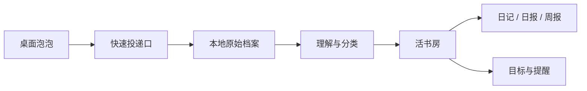

# Paopao 泡泡 - 桌面智能 Agent

泡泡是一个常驻 Windows 桌面的智能生命入口。它接住文字、语音、链接、图片和文件，先保留原始材料，再把长期反复出现的思想、目标、人物、阅读和日常自动装订进一间会生长的私人书房。


## 现在的主产品

- `desktop-app/`：Electron + React + TypeScript + Three.js 的 Windows 桌面 Agent。
- 桌面泡泡：透明悬浮、可拖动靠边、单击投递、双击打开活书房。
- 快速投递口：文字、语音、链接、图片和文件的实时入口。
- 活书房：日记、思想、人物、阅读、目标、日报和周报按书脊生长。
- `preview/`：为了让任何人不用安装也能理解产品气质而做的在线活书房预览。

## 产品判断

泡泡不是一个网页，也不是每条都回复的聊天框。它更像一个桌面上的抽象智慧生命：安静地记住，长期地理解，在真正重要的节点给出独立判断和行动牵引。

它不模仿用户说话，而是依据有证据的长期模式形成自己的判断；用户可以纠正分类、撤销画像更新、编辑日记和报告。

## 快速体验

在线预览：

```text
https://74stars.github.io/paopao-ai-avatar-agent/preview/
```

直达入口：

- 快速投递：`https://74stars.github.io/paopao-ai-avatar-agent/preview/?demo=capture`
- 周报阅读：`https://74stars.github.io/paopao-ai-avatar-agent/preview/?demo=reader&theme=night`

本地运行桌面应用：

```powershell
cd desktop-app
npm.cmd install
npm.cmd run dev
```

## 技术架构



- Electron 主进程负责窗口、快捷键、托盘、通知、数据库、密钥和调度。
- Renderer 只负责界面，通过隔离 preload API 访问能力。
- Three.js 渲染泡泡生命体和活书房氛围。
- SQLite 作为本地权威数据源，Supabase 同步默认关闭。
- API Key 使用 Electron safeStorage，不进入 Renderer 或日志。

## 目录

- `desktop-app/`：桌面 Agent 源码。
- `preview/`：零依赖在线活书房预览。
- `prototype/`：早期网页原型，保留作产品演进记录。
- `feishu-bot/`：早期飞书消息入口骨架。
- `docs/`：产品架构、Prompt、Coze workflow、指标与日志。

## 当前路线

- 完成桌面泡泡、快速投递口和活书房的最小闭环。
- 接入真实语音转写、链接解析和文件归档。
- 生成日报、周报与可编辑日记本。
- 做成 Windows 可安装版本，并保留在线预览作为作品入口。
