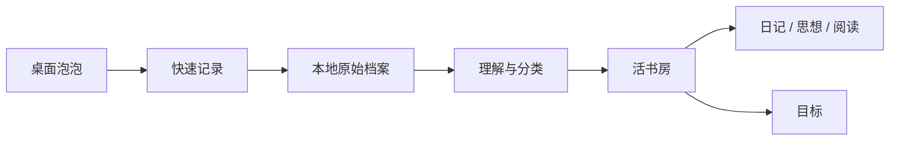

# 泡泡（Paopao）— 桌面记录与活书房

泡泡是一个常驻 macOS/Windows 桌面的本地优先文字记录入口。它先把原文可靠保存在本机，再将可追溯的思想、目标、人物、阅读和日常整理进活书房，形成属于你自己的记忆系统。


> **v0.1.0 已正式发布**（2026-08-15，GitHub Release 分发，未签名）→ [下载与验证](#发布与下载)

## 功能特性

- **桌面泡泡**：透明悬浮、可拖动靠边、单击投递、双击打开活书房；托盘常驻、全局快捷键（`Ctrl+Shift+Space` / `Cmd+Shift+Space`）随时唤起快速记录。
- **快速记录**：支持“记住”和“思考”两种模式，原文先落盘再异步整理。
- **活书房**：日记、思想、人物、阅读和目标按书脊生长；支持搜索、整理依据追溯、分类与摘要调整、修订历史。
- **数据治理**：删除生命周期、独立安全快照、备份恢复、导出与诊断导出。
- **AI 整理**：多个命名 Provider Profile、单 active Profile、OpenAI 兼容接口；凭据 write-only 写入并经 Electron `safeStorage` 加密，Renderer 无读取接口。
- **本地优先**：SQLite 是唯一权威数据源，事务边界清晰，无云同步依赖。

## 发布与下载

第一个桌面 MVP 正式版 **Paopao v0.1.0** 已发布：

- 下载地址：https://github.com/74stars/paopao-ai-avatar-agent/releases/tag/v0.1.0
- 平台资产：Windows x64 NSIS 安装包（`Paopao-Setup-0.1.0.exe`）；macOS Apple 芯片（`Paopao-0.1.0-arm64.dmg`/`.zip`）与 Intel（`Paopao-0.1.0-x64.dmg`/`.zip`）。
- 分发策略：**GitHub Release 分发，不使用开发者签名/公证**（项目决策）。每个资产附 SHA-256 清单（`SHA256SUMS.txt`）、安装/卸载冒烟证据（`INSTALL-SMOKE-*.txt`）与构建溯源证明（attestation）；请核对校验和后安装。
- 发布与验证细节：[Release operations](docs/releases/README.md)、[v0.1.0 release notes](docs/releases/v0.1.0.md)。

## 安装与使用

### Windows

1. 下载 `Paopao-Setup-0.1.0.exe`，双击安装（可自选安装目录）。
2. 安装后从开始菜单或桌面快捷方式启动；首次启动会在用户数据目录创建本地 SQLite 数据库。

### macOS

1. 下载与机器架构匹配的 DMG（Apple 芯片选 `arm64`，Intel 选 `x64`），挂载后把“泡泡”拖入“应用程序”。
2. 首次启动如被 Gatekeeper 拦截：应用为未签名分发，可在“系统设置 → 隐私与安全性”中允许打开（按项目未签名策略，请自行评估信任）。

### 数据与卸载行为

- 泡泡把用户数据保存在本地用户数据目录；Windows 卸载和 macOS 删除应用**不会**删除用户数据。
- 进行破坏性维护前，请先在设置中使用“导出”或“备份”保存数据。

## 快速体验

在线预览（隔离模拟数据，不接入桌面数据库，也不代表未开放能力已实现）：

```text
https://74stars.github.io/paopao-ai-avatar-agent/preview/
```

直达入口：

- 快速记录：`https://74stars.github.io/paopao-ai-avatar-agent/preview/?demo=capture`
- 记录阅读：`https://74stars.github.io/paopao-ai-avatar-agent/preview/?demo=reader&theme=night`

本地运行桌面应用：

```powershell
npm.cmd install
npm.cmd run dev --workspace=paopao-desktop
```

## 技术架构


```mermaid
flowchart LR
  Pet[桌面泡泡] --> Capture[快速记录]
  Capture --> Raw[本地原始档案]
  Raw --> AI[理解与分类]
  AI --> Books[活书房]
  Books --> Diary[日记 / 思想 / 阅读]
  Books --> Goals[目标]
```

- **Electron 主进程**：窗口生命周期、托盘、全局快捷键、通知、数据库、密钥、调度与备份恢复的组合根。
- **Renderer**：只负责界面，通过隔离的 typed preload API 访问能力；沙箱开启、`contextIsolation` 开启、无 Node 集成。
- **SQLite（better-sqlite3）**：本地唯一权威数据源；保存、任务、派生结果、全文搜索与删除均有事务边界。
- **AI 层**：OpenAI 兼容 Provider（Responses / Chat Completions）、结构化输出、错误脱敏；Profile 凭据经 `safeStorage` 加密，不进入 Renderer 或日志。

## 安全与数据

- Renderer 进程沙箱化，仅暴露语义化 preload 命令，无凭据读取接口、无原始 IPC。
- Provider 与飞书凭据 write-only 提交，落盘经系统密钥链加密。
- 删除流程带删除态校验与事务围栏；备份/恢复带迁移前快照与回滚 journal。

## 开发

### 环境要求

- Node `>=22.14.0 <25`、npm `>=10.9.0 <12`（`packageManager: npm@11.6.0`）。
- npm workspace：`desktop-app`、`packages/*`（contracts / domain / core / infrastructure）、`adapters/*`（feishu）。

### 常用命令

```bash
npm install                     # 安装全部 workspace 依赖
npm run dev --workspace=paopao-desktop   # 启动桌面应用开发模式
npm run typecheck              # 全量类型检查
npm test                       # 契约 + 单元 + 集成 + 离线评测
npm run test:e2e               # Electron Wave 4 E2E
npm run test:e2e:preview       # Preview 可访问性 E2E
npm run build                  # 构建全部 workspace 与桌面应用
npm run dist:win               # Windows NSIS 安装包
npm run dist:mac               # macOS x64/arm64 DMG 与 ZIP
npm run release:verify -- --tag v0.1.0   # 发布前元数据门禁
```

> 注意：`better-sqlite3` 是 ABI 敏感原生模块——Electron 打包用 `npm run rebuild:native`，Node 测试用 `npm run rebuild:native:node`，两者会互相覆盖，请勿并发执行。

### 发布流程

正式发布由 `.github/workflows/release.yml` 执行：annotated tag 推送 → 元数据/全量验证 → Windows/macOS 原生打包与干净机安装/卸载矩阵 → SHA-256 清单与构建溯源 → 创建 GitHub Release。详细规则见 [Release operations](docs/releases/README.md)。

## 目录结构

- `desktop-app/`：Electron + React + TypeScript 桌面应用（主进程、preload、Renderer、构建与图标工程）。
- `packages/`：契约（contracts）、领域（domain）、核心（core）、基础设施（infrastructure，SQLite/AI/备份/调度）。
- `adapters/feishu/`：已完成自动化验证的实验性飞书适配器，保留为后续功能基线。
- `preview/`：零依赖在线活书房预览（隔离模拟数据）。
- `prototype/`：早期网页原型，保留作产品演进记录。
- `feishu-bot/`：早期飞书消息入口骨架，仅作历史记录，不进入当前运行路径。
- `prompts/`：AI 整理 Prompt Registry。
- `evals/`：离线评测管道。
- `tests/`：E2E、跨层集成与安全测试。
- `scripts/`：发布验证与运行时冒烟脚本。
- `assets/`：仓库级展示与历史截图。

## 文档索引

- [文档统一索引](docs/README.md)：需求、状态、审核、设计、决策与历史材料入口。
- [MVP 执行总纲](docs/mvp/README.md) 与 [当前 Gate 状态](docs/mvp/gate-status.md)：唯一动态工程、验证与发布状态源。
- [Release operations](docs/releases/README.md) 与 [v0.1.0 release notes](docs/releases/v0.1.0.md)。
- [ADR 决策记录](docs/adr/README.md)：跨模块与范围变化（含设计资产 Git LFS 决策 ADR 0006）。

## 路线图

- **已完成**：文字捕获、SQLite 持久化、持久任务、AI 结构化整理、活书房浏览/搜索/治理、导出/备份/删除、AI Provider 配置、桌面交互与托盘、`v0.1.0` 正式发布。
- **MVP 外（按真实需求扩展）**：语音、图片、链接与文件捕获，日报、周报，飞书连接器产品化（真实租户验收），云同步。
- 工程测试只提供工程证据；每轮实际画面继续输出下一轮美术指导，不设置软件意义上的美术 PASS。
