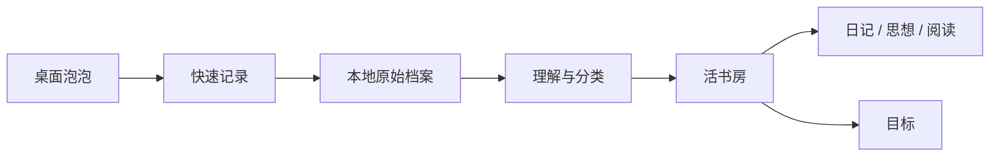

# 泡泡（Paopao）

泡泡是一个常驻 macOS 和 Windows 桌面的本地优先记录工具。它把文字原文先保存在自己电脑上，再帮你把思想、目标、人物、阅读和日常，整理进一个会生长的“活书房”。


## 它能做什么

- **随手记录**：桌面泡泡常驻屏幕边缘，单击投递、双击打开活书房；支持“记住”和“思考”两种方式，随时保存一段文字。
- **活书房**：日记、思想、人物、阅读和目标像书一样摆上书架，按真实的内容生长。
- **找得到**：搜索、分类和摘要整理，每一条整理都回溯到原始记录。
- **你的数据你做主**：可以修改、删除、导出和备份，一切保存在本机。

## 下载

**Paopao v0.1.0** 已发布：

- [前往 GitHub Releases 下载](https://github.com/74stars/paopao-ai-avatar-agent/releases/tag/v0.1.0)
- Windows：`Paopao-Setup-0.1.0.exe`
- macOS Apple 芯片：`Paopao-0.1.0-arm64.dmg`
- macOS Intel：`Paopao-0.1.0-x64.dmg`

## 使用入门

### Windows

下载安装包，双击按提示完成安装，即可从开始菜单启动。

### macOS

下载与你电脑匹配的 DMG（Apple 芯片选 arm64，Intel 选 x64），打开后把“泡泡”拖进“应用程序”。

### 数据说明

泡泡的数据全部保存在本机；卸载应用不会删除你的记录。需要清理电脑或重装前，可以用应用内的“导出”或“备份”先保存一份。

## 在线预览

不用安装也能先感受一下（演示数据，不会连接你的电脑）：

- [打开预览](https://74stars.github.io/paopao-ai-avatar-agent/preview/)
- [快速记录演示](https://74stars.github.io/paopao-ai-avatar-agent/preview/?demo=capture)
- [记录阅读演示](https://74stars.github.io/paopao-ai-avatar-agent/preview/?demo=reader&theme=night)

## 它是怎么工作的


```mermaid
flowchart LR
  Pet[桌面泡泡] --> Capture[快速记录]
  Capture --> Raw[本地原始档案]
  Raw --> AI[理解与分类]
  AI --> Books[活书房]
  Books --> Diary[日记 / 思想 / 阅读]
  Books --> Goals[目标]
```

- 记录先落到本机数据库，再异步整理；不依赖网络，也不用担心云端存储。
- 桌面应用基于 Electron，界面与数据能力隔离，凭据在系统钥匙链里加密保存。

## 本地开发

环境要求：Node `>=22.14.0 <25`、npm `>=10.9.0 <12`。

```bash
npm install
npm run dev --workspace=paopao-desktop   # 启动桌面应用
npm run typecheck                       # 类型检查
npm test                                # 全量测试
npm run build                           # 构建
npm run dist:win                        # Windows 安装包
npm run dist:mac                        # macOS DMG/ZIP
```

## 文档

- [文档索引](docs/README.md)
- [当前 Gate 状态](docs/mvp/gate-status.md)
- [发布说明](docs/releases/README.md)

## 路线图

- **已完成**：文字记录、本地存储、自动整理、活书房浏览与搜索、数据导出备份、AI 服务配置、Windows/macOS 桌面应用，以及 v0.1.0 正式发布。
- **规划中**：语音、图片、链接和文件记录，日报周报，飞书连接，以及更多记录方式。
