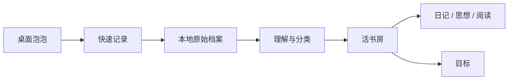

# 泡泡 - 桌面记录与活书房

泡泡是一个常驻 macOS/Windows 桌面的本地优先文字记录入口。它先把原文可靠保存在本机，再将可追溯的思想、目标、人物、阅读和日常整理进活书房。


## 现在的主产品

- `desktop-app/`：Electron + React + TypeScript 的 macOS/Windows 桌面应用。
- 桌面泡泡：透明悬浮、可拖动靠边、单击投递、双击打开活书房。
- 快速记录：随时保存文字，支持“记住”和“思考”两种模式。
- 活书房：日记、思想、人物、阅读和目标按书脊生长；日报、周报暂不属于 MVP。
- `preview/`：使用隔离模拟数据展示产品气质和未来概念，不接入桌面数据库，也不代表未开放能力已经实现。

## 产品判断

泡泡不是网页或聊天框，而是桌面常驻的记录入口：安静保存内容，并在需要时提供整理和洞察。

它依据可追溯的记录形成整理和洞察；用户可以编辑记录、调整分类与摘要、删除并导出自己的数据。

## 发布与下载

Paopao v0.1.0（第一个桌面 MVP 正式版）已通过 GitHub Release 发布：

- 下载地址：https://github.com/74stars/paopao-ai-avatar-agent/releases/tag/v0.1.0
- 平台资产：Windows x64 NSIS 安装包（`Paopao-Setup-0.1.0.exe`）、macOS arm64/x64 DMG 与 ZIP。
- 分发策略：GitHub Release 分发，未签名（无开发者签名/公证）；每个资产均附 SHA-256 清单、安装/卸载冒烟证据与构建溯源证明，请核对 `SHA256SUMS.txt` 后再安装。
- 发布与验证细节见 [Release operations](docs/releases/README.md) 与 [v0.1.0 release notes](docs/releases/v0.1.0.md)。

## 快速体验

在线预览：

```text
https://74stars.github.io/paopao-ai-avatar-agent/preview/
```

在线页面是模拟数据概念演示。当前桌面 MVP 仅支持文字记录；语音、图片、链接、文件和报告入口尚未开放。

直达入口：

- 快速记录：`https://74stars.github.io/paopao-ai-avatar-agent/preview/?demo=capture`
- 记录阅读：`https://74stars.github.io/paopao-ai-avatar-agent/preview/?demo=reader&theme=night`

本地运行桌面应用：

```powershell
npm.cmd install
npm.cmd run dev --workspace=paopao-desktop
```

## 技术架构


```mermaid
flowchart LR
  Pet[桌面泡泡] --> Capture[快速记录]
  Capture --> Raw[本地原始档案]
  Raw --> AI[理解与分类]
  AI --> Books[活书房]
  Books --> Diary[日记 / 思想 / 阅读]
  Books --> Goals[目标]
```

- Electron 主进程负责窗口、快捷键、托盘、通知、数据库、密钥和调度。
- Renderer 只负责界面，通过隔离 preload API 访问能力。
- Renderer 提供泡泡、记录窗口和活书房的交互界面。
- SQLite 是本地唯一权威数据源；MVP 不包含云同步。
- API Key 使用 Electron safeStorage，不进入 Renderer 或日志。

## 目录

- `desktop-app/`：桌面应用源码。
- `adapters/feishu/`：已完成自动化验证的实验性飞书适配器，保留为后续功能基线。
- `preview/`：零依赖在线活书房预览。
- `prototype/`：早期网页原型，保留作产品演进记录。
- `feishu-bot/`：早期飞书消息入口骨架，仅作历史记录，不进入当前运行路径。
- `docs/PAOPAO-MVP-PLAN.md`：当前本地优先 MVP 的范围、架构、开发阶段与验收标准；飞书作为 MVP 后增量记录。
- `docs/PAOPAO-V1-PROJECT-SPEC.md`：成熟 V1 的完整链路、实施路线与验收标准。
- `docs/README.md`：当前需求、状态、审核、设计、决策与历史材料的统一文档索引。

## 当前路线

- 本地“文字输入 -> 本地存储 -> 持久化任务 -> 自动整理 -> 活书房”闭环已通过自动化验证。
- 搜索、整理依据、分类与摘要调整、记录版本、删除、导出、备份恢复和 AI 服务配置已经接入。
- 可复现 Git/LFS 基线和正式 release workflow 已建立；v0.1.0 已发布（GitHub Release 分发，未签名），后续版本沿用同一门禁：远端 push/tag、Windows/macOS 干净 runner 构建与安装/卸载矩阵、SHA-256 清单与构建溯源证明。
- 截图和交互检查只提供工程证据；每轮实际画面继续输出下一轮美术指导，不设置软件意义上的美术 PASS。
- 飞书连接器移至 MVP 后增量；现有代码保留，但真实租户验收和正式产品化延期。
- 语音、图片、链接、文件、日报和周报在 MVP 验收后按真实需求扩展。
