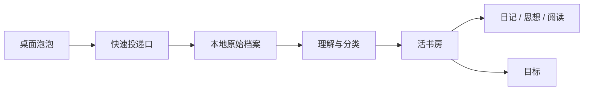

# Paopao 泡泡 - 桌面智能 Agent

泡泡是一个常驻 macOS/Windows 桌面的本地优先文字记录入口。MVP 先把原文可靠保存到本机，再把可追溯的思想、目标、人物、阅读和日常装订进活书房。


## 现在的主产品

- `desktop-app/`：Electron + React + TypeScript 的 macOS/Windows 桌面 Agent。
- 桌面泡泡：透明悬浮、可拖动靠边、单击投递、双击打开活书房。
- 快速投递口：文字实时入口，默认只记住，也可显式请求思考。
- 活书房：日记、思想、人物、阅读和目标按书脊生长；日报、周报暂不属于 MVP。
- `preview/`：为了让任何人不用安装也能理解产品气质而做的在线活书房预览。

## 产品判断

泡泡不是一个网页，也不是每条都回复的聊天框。它更像一个桌面上的抽象智慧生命：安静地记住，长期地理解，在真正重要的节点给出独立判断和行动牵引。

它不模仿用户说话，而是依据可追溯的记录形成整理和洞察；用户可以编辑记录、调整 AI 分类与摘要、删除并导出自己的数据。

## 快速体验

在线预览：

```text
https://74stars.github.io/paopao-ai-avatar-agent/preview/
```

直达入口：

- 快速投递：`https://74stars.github.io/paopao-ai-avatar-agent/preview/?demo=capture`
- 周报阅读：`https://74stars.github.io/paopao-ai-avatar-agent/preview/?demo=reader&theme=night`

本地运行桌面应用：

```powershell
npm.cmd install
npm.cmd run dev --workspace=paopao-desktop
```

## 技术架构


```mermaid
flowchart LR
  Pet[桌面泡泡] --> Capture[快速投递口]
  Capture --> Raw[本地原始档案]
  Raw --> AI[理解与分类]
  AI --> Books[活书房]
  Books --> Diary[日记 / 思想 / 阅读]
  Books --> Goals[目标]
```

- Electron 主进程负责窗口、快捷键、托盘、通知、数据库、密钥和调度。
- Renderer 只负责界面，通过隔离 preload API 访问能力。
- Renderer 提供泡泡、记录窗口和活书房的交互界面。
- SQLite 是本地唯一权威数据源；MVP 不包含云同步。
- API Key 使用 Electron safeStorage，不进入 Renderer 或日志。

## 目录

- `desktop-app/`：桌面 Agent 源码。
- `adapters/feishu/`：已完成自动化验证的实验性飞书 Adapter，保留为 MVP 后增量基线。
- `preview/`：零依赖在线活书房预览。
- `prototype/`：早期网页原型，保留作产品演进记录。
- `feishu-bot/`：早期飞书消息入口骨架，仅作历史记录，不进入当前运行路径。
- `docs/PAOPAO-MVP-PLAN.md`：当前本地优先 MVP 的范围、架构、开发阶段与验收标准；飞书作为 MVP 后增量记录。
- `docs/PAOPAO-V1-PROJECT-SPEC.md`：成熟 V1 的完整链路、实施路线与验收标准。
- `docs/`：产品架构、Prompt、Coze workflow、指标与日志。

## 当前路线

- 本地“文字输入 -> SQLite -> 持久化任务 -> AI 整理 -> 真实书房”闭环已通过自动化门禁。
- 搜索、整理依据、分类/摘要调整、记录 revision、删除、导出、备份恢复和 Provider 配置已经接入。
- 当前优先建立可复现 Git 基线，并完成 macOS x64、Windows x64、干净机、真实窗口拖动和公开签名验收。
- 截图和交互检查只提供工程证据；每轮实际画面继续输出下一轮美术指导，不设置软件意义上的美术 PASS。
- 飞书连接器移至 MVP 后增量；现有代码保留，但真实租户验收和正式产品化延期。
- 语音、图片、链接、文件、日报和周报在 MVP 验收后按真实需求扩展。
