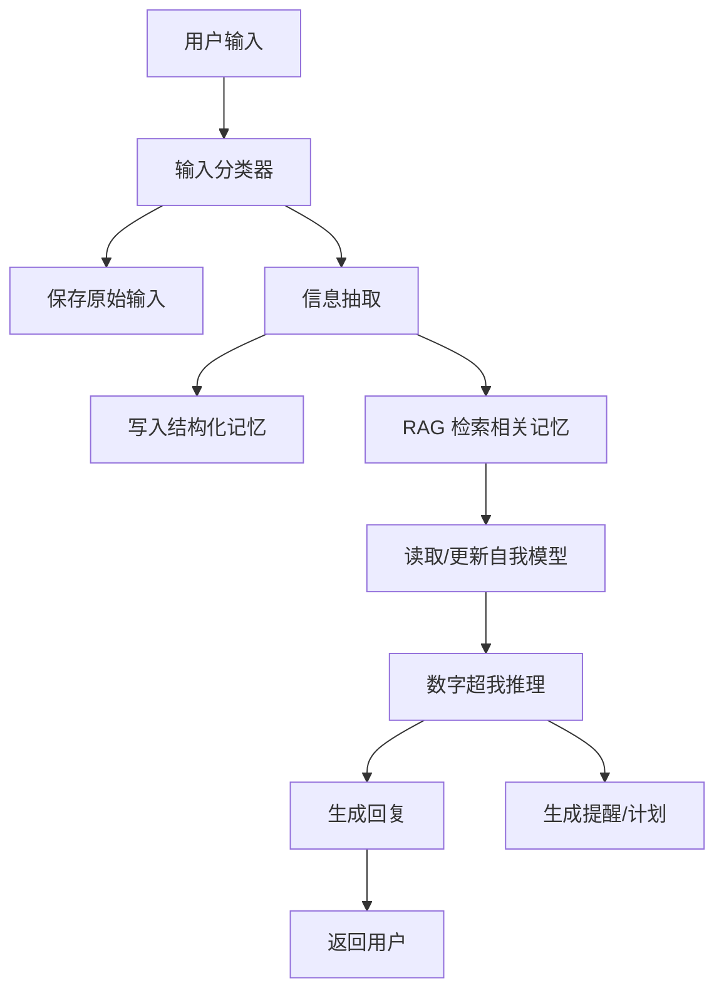

# Coze Workflow 设计｜AI 数字分身 Agent

## 1. Coze Bot 定位

Bot 名称：Paopao 泡泡

Bot 角色：用户的长期记忆系统、数字分身和七年跃迁教练。

Bot 目标：

- 接收用户每天的碎片输入
- 识别欲望、目标、人物、地点、书籍、机会和行动
- 调用知识库/RAG 检索用户过去内容
- 生成正向、积极、有推动力的回复
- 定期生成日记、复盘和提醒

## 2. 工作流总览



## 3. 节点设计

### Node 1：Input Classifier

判断输入类型：

- capture：普通记录
- goal：目标
- desire：欲望
- book：阅读
- person：人物观察
- schedule：日程
- link：链接
- location：地点/旅行
- reflection：复盘

输出 JSON：

```json
{
  "input_type": "desire",
  "modality": "text",
  "priority": "high",
  "should_reply": true,
  "should_update_self_model": true
}
```

### Node 2：Memory Extractor

抽取结构化信息：

```json
{
  "summary": "用户表达了强烈财富目标",
  "entities": ["赚钱", "财富", "能力变现"],
  "growth_axis": ["财富", "认知", "行动"],
  "desire": "赚很多钱",
  "possible_next_action": "拆出一个 30 天验证项目"
}
```

### Node 3：RAG Retriever

检索：

- 过去相似欲望
- 过去相关目标
- 过去提过的人
- 过去读过的书
- 过去类似偏离或突破

### Node 4：Self Model Updater

判断是否需要更新：

- 新增目标
- 新增榜样
- 新增禁用语气
- 新增成长轴
- 修正用户身份方向

### Node 5：Paopao Reasoner

根据：

- 当前输入
- 检索记忆
- 用户自我模型
- 当前时间/地点/天气
- 用户目标

生成回复。

## 4. Coze 知识库设计

建议拆成 5 个知识库：

1. `raw_life_archive`
   原始生活记录。

2. `self_model`
   用户长期画像。

3. `goals_and_plans`
   七年目标、年度目标、月计划、日程。

4. `reading_and_world_model`
   阅读笔记、人性观察、商业/历史/社会认知。

5. `ideal_self_library`
   榜样人物与能力结构，如谷爱凌、马斯克、纳瓦尔等。

## 5. Coze 插件/工具规划

- Web Search：检索榜样人物公开资料、书籍资料、概念解释。
- Feishu：接收和发送消息。
- Calendar：写入日程和提醒。
- Weather：记录当天真实世界上下文。
- Image Understanding：理解截图、手绘、图片。
- Speech-to-Text：语音转写。

## 6. 回复策略

泡泡回复必须满足：

1. 不用负面标签定义用户。
2. 不只安慰，要给更高认知或下一步。
3. 不把用户框定在 MBTI 等标签里。
4. 对欲望持开放态度，帮助显化为路径。
5. 对目标持长期主义，帮助拆解为行动。
6. 对思考持资产化态度，帮助沉淀为模型。

## 7. 示例 Workflow

用户：

> 我想在 30 岁前赚很多钱，也想成为有影响力的人。

系统：

1. 分类为 desire + goal。
2. 写入财富目标与影响力目标。
3. 检索过去是否提过赚钱、领导力、作品。
4. 更新 self_model 的 ambitions。
5. 回复：

> 我收到了，这是你的长期主线，不是普通愿望。  
> 我会把它写入“财富与影响力”成长轴。  
> 现在先拆第一个问题：你想通过哪种能力进入市场？内容、产品、技术、咨询、交易，还是组织能力？

