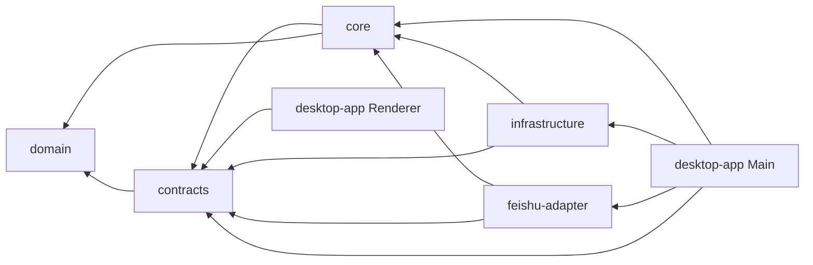

# Paopao MVP 跨 Agent 接口契约

> 契约版本：v1  
> 状态：实现前冻结  
> 变更负责人：Contract Agent  
> 适用范围：Desktop Renderer、Electron Main、Core、Infrastructure、AI、Feishu Adapter、测试  
> 范围修订：2026-08-08，Feishu Adapter 契约保留为已实现的 MVP 后增量兼容基线，不属于当前 MVP 交付或 G4 前置，见 [`ADR 0004`](../adr/0004-defer-feishu-post-mvp.md)

本文是多 Agent 并行实现时的接口单一事实源。代码中的 Zod Schema、TypeScript 类型、数据库迁移和契约测试必须与本文一致。业务 Agent 不得在自己的模块里复制或悄悄扩展这些枚举。

## 1. 约定

### 1.1 基础约定

- TypeScript/IPC 使用 `camelCase`，SQLite 使用 `snake_case`，映射只发生在 Repository。
- 所有 ID 使用 UUID；外部飞书 ID 保持原值，不伪装成内部 UUID。
- 所有跨进程时间使用带 `Z` 的 ISO 8601 UTC 字符串；SQLite 同样存 UTC 文本。
- 所有 Schema 必须 `.strict()`，未知字段视为契约错误。
- 金额、Token 和持续时间不得用隐含单位；本契约中的延迟统一使用 `Ms` 后缀。
- 分页使用不透明 cursor，不向 Renderer 暴露自增 ID、SQL offset 或表结构。
- `rawText` 指首次接收的不可变原文，保存时不得 trim 或规范化；只用 `rawText.trim()` 判断是否全空白。`currentText` 指最新用户 revision。
- UI、日志和 Adapter 只能消费 DTO，不能返回 `better-sqlite3` Row。

### 1.2 包和依赖方向

M0 建立 npm workspaces，冻结以下目录和包名：

```text
packages/domain/          @paopao/domain
packages/contracts/       @paopao/contracts
packages/core/            @paopao/core
packages/infrastructure/  @paopao/infrastructure
adapters/feishu/          @paopao/feishu-adapter
desktop-app/              paopao-desktop
```

允许的依赖方向（箭头表示 `depends on`）：



`domain` 不依赖 Zod、Electron、SQLite 或具体 Provider；`contracts` 是与运行环境无关的应用边界 Schema，因此 `core` 可以消费它，但不依赖任何 IPC/Electron 实现；`infrastructure` 实现 Core 端口；Renderer 只依赖 contracts。`desktop-app Main` 是唯一 composition root，可以依赖 `@paopao/feishu-adapter` 并注入 Main-only 凭据和生命周期依赖；Adapter 不能反向依赖 Electron。

禁止：

- `core -> electron`
- `core -> better-sqlite3`
- `core -> 具体 AI SDK`
- `renderer -> core/infrastructure`
- `feishu-adapter -> SQLite 实现`
- `preview -> 任意生产包`

## 2. 统一结果与错误

所有 IPC 方法返回 `Result<T>`，不把原始异常跨进程抛给 Renderer：

```ts
type Result<T> =
  | { ok: true; data: T }
  | { ok: false; error: AppError };

interface AppError {
  code: ErrorCode;
  message: string;
  retryable: boolean;
  correlationId: string;
  details?: Record<string, string | number | boolean | null>;
}
```

`details` 必须经过白名单构造，不得包含原文、Prompt、Key、Secret、Token 或飞书消息正文。

冻结错误码：

```ts
type ErrorCode =
  | "VALIDATION_FAILED"
  | "NOT_FOUND"
  | "REVISION_CONFLICT"
  | "ALREADY_DELETED"
  | "DATABASE_UNAVAILABLE"
  | "NETWORK_OFFLINE"
  | "SAFE_STORAGE_UNAVAILABLE"
  | "JOB_NOT_RETRYABLE"
  | "AI_NOT_CONFIGURED"
  | "AI_AUTH_FAILED"
  | "AI_NETWORK_ERROR"
  | "AI_TIMEOUT"
  | "AI_RATE_LIMITED"
  | "AI_SAFETY_BLOCKED"
  | "AI_INPUT_TOO_LARGE"
  | "AI_INVALID_OUTPUT"
  | "AI_FAILED_FINAL"
  | "FEISHU_NOT_CONFIGURED"
  | "FEISHU_AUTH_FAILED"
  | "FEISHU_NOT_CONNECTED"
  | "FEISHU_NOT_BOUND"
  | "FEISHU_PERMISSION_DENIED"
  | "BINDING_CODE_INVALID"
  | "BINDING_CODE_EXPIRED"
  | "BINDING_CODE_CONSUMED"
  | "BINDING_RATE_LIMITED"
  | "DELIVERY_AMBIGUOUS"
  | "DELIVERY_FAILED_FINAL"
  | "BACKUP_INVALID"
  | "RESTORE_FAILED"
  | "EXPORT_FAILED"
  | "DIAGNOSTICS_EXPORT_FAILED"
  | "INTERNAL_ERROR";
```

用户文案由 Renderer 根据 `code` 映射；Main/Core 不返回 Provider 堆栈或数据库错误文本。

## 3. 领域枚举与状态机

```ts
type EntrySource = "desktop" | "feishu";
type EntryModality = "text";
type CaptureMode = "remember" | "think";

type EntryStatus =
  | "stored"
  | "processing"
  | "retry_wait"
  | "needs_review"
  | "ready"
  | "failed_final"
  | "deleting"
  | "purged";

type JobType =
  | "analyze_entry"
  | "generate_insight"
  | "purge_entry"
  | "create_export"
  | "create_diagnostics_export";
type JobStatus =
  | "queued"
  | "running"
  | "retry_wait"
  | "waiting_for_network"
  | "waiting_for_configuration"
  | "succeeded"
  | "failed_final"
  | "cancelled";

type MemoryType = "diary" | "thought" | "person" | "reading" | "goal" | "other";
type DerivationKind =
  | "classification"
  | "summary"
  | "entities"
  | "goals"
  | "next_actions"
  | "insight_reply";

type CreatedBy = "ai" | "user" | "system";
```

Entry 状态迁移：

```text
stored -> processing -> ready
                 |-> retry_wait -> processing
                 |-> needs_review -> processing | ready
                 |-> failed_final -> processing (仅手动重跑)

stored | processing | retry_wait | needs_review | ready | failed_final
  -> deleting -> purged
```

Job 状态迁移：

```text
queued -> running -> succeeded
             |-> retry_wait -> running
             |-> waiting_for_network -> queued
             |-> waiting_for_configuration -> queued
             |-> failed_final
queued | retry_wait | waiting_for_network | waiting_for_configuration -> cancelled
```

约束：

- `purged` 是只保留非敏感墓碑的终态，不能恢复或重跑。
- `failed_final` 不表示数据丢失，原文仍可查看。
- Worker 只能通过 Core 状态机改变状态，不能直接写任意字符串。
- `needs_review` 用于结构化输出无法可靠校验，但原文仍完好。

## 4. Capture 契约

### 4.1 Renderer 请求

Renderer 只能提交桌面请求，`source` 和接收时间由 Main 补充：

```ts
interface DesktopCaptureRequestV1 {
  version: 1;
  requestId: string;       // UUID，每次用户提交生成一次，重试复用
  rawText: string;         // 原样保存；trim 后须非空；最多 50_000 code points
  mode: CaptureMode;       // UI 默认 remember，用户显式切换 think
}

interface CaptureReceiptV1 {
  entryId: string;
  jobId: string;
  status: "stored";
  deduplicated: boolean;
  createdAt: string;
}
```

Main 必须忽略 Renderer 伪造的 `source`、`createdAt`、外部 ID 或状态字段。

### 4.2 Core 内部命令

```ts
interface CaptureCommandV1 {
  version: 1;
  requestId: string;
  source: EntrySource;
  modality: "text";
  rawText: string;
  mode: CaptureMode;
  receivedAt: string;
  sourceKey: string;
  externalRef?: {
    provider: "feishu";
    appId: string;
    tenantKey: string;
    openId: string;
    chatId: string;
    chatType: "p2p";
    messageId: string;
    eventId: string;
    messageKey: string;
    eventKey: string;
  };
}
```

幂等键规则：

```text
desktop sourceKey = desktop:<requestId>
feishu sourceKey/messageKey = feishu:sha256(<appId>\0<tenantKey>\0<messageId>)
feishu eventKey   = feishu:sha256(<appId>\0<eventId>)
job key           = analyze_entry:<entryId>:text_revision:<revision>
insight key       = generate_insight:<entryId>:text_revision:<revision>
purge key         = purge_entry:<entryId>
export key        = create_export:<exportId>
diagnostics key   = create_diagnostics_export:<diagnosticExportId>
```

内容 SHA-256 只用于完整性和诊断，不能用来合并两次用户主动提交。

### 4.3 事务后置条件

`CaptureService.capture()` 返回成功之前，必须在一个 SQLite 事务中完成：

1. 以 `source_key` 查询幂等结果。
2. 首次请求写入 `entries`。
3. 写入 revision 1 的 `entry_text_revisions`。
4. 写入 `analyze_entry` Job。
5. 飞书来源同时以幂等 insert 登记 `processed_events(event_key -> message_key)`，并 upsert `external_messages(message_key -> entryId/recipient/ack/result)`；ack 初始 `pending`，result 按 mode 初始为 `not_required` 或 `waiting`。同一 event 重放不报错，同一 message 的多个 event 关联同一个 canonical message。
6. 提交事务。

事务外才能发布 `entry:stored`、启动 AI 请求或发送飞书回复。重复请求返回原 `entryId/jobId`，并设置 `deduplicated: true`。

## 5. Entry 查询与修改 DTO

### 5.1 列表

```ts
interface EntryListRequestV1 {
  version: 1;
  cursor?: string;
  limit?: number;          // default 30, min 1, max 100
  query?: string;          // max 200
  types?: MemoryType[];
  statuses?: EntryStatus[];
  sources?: EntrySource[];
}

interface EntryListItemV1 {
  id: string;
  source: EntrySource;
  currentTextPreview: string; // max 240 chars
  title: string;
  summary: string | null;
  memoryType: MemoryType | null;
  status: EntryStatus;
  createdAt: string;
  updatedAt: string;
  latestRevision: number;
  lastErrorCode: ErrorCode | null;
}

interface EntryListResponseV1 {
  items: EntryListItemV1[];
  nextCursor: string | null;
}
```

排序冻结为 `created_at DESC, id DESC`。cursor 是这两个字段的编码组合，由 Repository 生成并验证。

`title` 不是独立 AI 字段：只取 `currentText` 的首个非空句或非空行并截到 80 chars。AI summary 不能覆盖记录标题或列表预览。该规则由查询服务统一实现，Renderer 不自行拼接。

### 5.2 详情

```ts
interface ClassificationValueV1 {
  inputType: MemoryType;
  confidence: number;
  evidence: string;
}

interface SummaryValueV1 {
  text: string;
  confidence: number;
  evidence: string[];
}

interface EntitiesValueV1 {
  items: Array<{
    type: "person" | "book" | "place" | "topic" | "organization";
    name: string;
    confidence: number;
    evidence: string;
  }>;
}

interface GoalsValueV1 {
  items: Array<{ title: string; confidence: number; evidence: string }>;
}

interface NextActionsValueV1 {
  items: Array<{ title: string; dueHint: string | null; confidence: number; evidence: string }>;
}

interface DerivationValueMapV1 {
  classification: ClassificationValueV1;
  summary: SummaryValueV1;
  entities: EntitiesValueV1;
  goals: GoalsValueV1;
  next_actions: NextActionsValueV1;
  insight_reply: InsightReplyV1;
}

type DerivationV1 = {
  [K in keyof DerivationValueMapV1]: {
    id: string;
    kind: K;
    value: DerivationValueMapV1[K];
    textRevision: number;
    artifactRevision: number;
    supersedesId: string | null;
    isCurrent: boolean;
    createdBy: CreatedBy;
    promptVersion: string | null;
    schemaVersion: string;
    createdAt: string;
  }
}[keyof DerivationValueMapV1];

interface EntryDetailV1 {
  id: string;
  source: EntrySource;
  rawText: string;
  currentText: string;
  textRevisions: Array<{
    revision: number;
    text: string;
    createdBy: CreatedBy;
    createdAt: string;
  }>;
  status: EntryStatus;
  createdAt: string;
  updatedAt: string;
  memory: {
    type: MemoryType;
    summary: string;
    confidence: number;
  } | null;
  derivations: DerivationV1[];
  sources: Array<{
    artifactType: "derivation" | "memory";
    artifactId: string;
    entryId: string;
    quote: string;
  }>;
  activeJobs: Array<{
    id: string;
    type: JobType;
    status: JobStatus;
    attempts: number;
    nextRunAt: string | null;
    lastErrorCode: ErrorCode | null;
  }>;
}
```

`activeJobs` 按 `running -> queued/waiting/retry -> createdAt` 排序，返回全部未终结 Job，不能假设同一 Entry 同时只有一个 Job。

Memory 的 `type` 来自 current classification，`summary` 来自 current summary，`confidence` 取两者 confidence 的较小值。Memory 至少绑定 classification evidence 和 summary evidence；空数组类型派生仍可通过 Entry 级来源解释，但任何可见断言都不能无来源。

### 5.3 编辑、纠正、删除和重跑

记录内容编辑实际创建新的 text revision；`rawText` 作为最初记录保持不变：

```ts
interface EntryReviseTextRequestV1 {
  version: 1;
  requestId: string;
  entryId: string;
  expectedTextRevision: number;
  text: string;
}

interface EditableDerivationValueMapV1 {
  classification: ClassificationValueV1;
  summary: SummaryValueV1;
  entities: EntitiesValueV1;
  goals: GoalsValueV1;
  next_actions: NextActionsValueV1;
}

type EntryCorrectRequestV1 = {
  [K in keyof EditableDerivationValueMapV1]: {
    version: 1;
    requestId: string;
    entryId: string;
    kind: K;
    expectedDerivationId: string | null;
    value: EditableDerivationValueMapV1[K];
  }
}[keyof EditableDerivationValueMapV1];

interface TextRevisionReceiptV1 {
  entryId: string;
  textRevision: number;
  affectedJobIds: string[];
}

interface CorrectionReceiptV1 {
  entryId: string;
  textRevision: number;
  derivationId: string;
  supersedesDerivationId: string | null;
  affectedJobIds: string[];
}

interface EntryDeleteRequestV1 {
  version: 1;
  requestId: string;
  entryId: string;
  expectedTextRevision: number;
  confirmation: "DELETE";
}

interface EntryDeleteReceiptV1 {
  entryId: string;
  deletionJobId: string;
  status: "deleting";
}

interface JobRetryRequestV1 {
  version: 1;
  jobId: string;
}
```

纠正规则：

- `expectedTextRevision` 或 `expectedDerivationId` 不匹配时返回 `REVISION_CONFLICT`，不得覆盖较新数据。
- AI 派生和用户修订分别保留，当前读模型优先使用最新用户修订。
- 修改记录内容会创建新的 `analyze_entry` Job；只改分类/摘要时重建 Memory 和 FTS，不再次调用模型。
- 每次纠正 append 新 derivation，用 `supersedesId/isCurrent` 切换当前版本，不能覆盖 AI 历史行。
- revision/correction/delete/export 的 UI 重试必须复用 requestId；derivation 使用 `ai:<jobId>:<kind>` 或 `user:<requestId>:<kind>` operation key 防止重复 append。
- 删除先在短事务中标记 `deleting`，取消未运行的 analyze/insight Job 并排队 purge；所有在途提交必须同时校验 fencing token、text revision 和 Entry 仍非 `deleting/purged`，防止数据复活。
- purge Job 清除原文、revision、派生、来源、Memory、FTS 和 AI 关联，只留下 ID、时间和删除状态墓碑。
- MVP 删除不可撤销，UI 必须二次确认；备份的保留周期和恢复边界必须在设置页说明。

## 6. IPC 与 preload

冻结 channel：

```text
paopao:v1:capture.create
paopao:v1:entry.list
paopao:v1:entry.get
paopao:v1:entry.reviseText
paopao:v1:entry.correct
paopao:v1:entry.delete
paopao:v1:library.summary
paopao:v1:job.retry
paopao:v1:export.create
paopao:v1:export.get
paopao:v1:diagnostics.createExport
paopao:v1:diagnostics.getExport
paopao:v1:backup.list
paopao:v1:backup.restore
paopao:v1:backup.status
paopao:v1:settings.getPublic
paopao:v1:settings.updatePublic
paopao:v1:settings.saveAiCredential
paopao:v1:settings.deleteAiCredential
paopao:v1:settings.saveFeishuCredential
paopao:v1:settings.deleteFeishuCredential
paopao:v1:feishu.connect
paopao:v1:feishu.disconnect
paopao:v1:feishu.createBindingCode
paopao:v1:feishu.listDeliveryIssues
paopao:v1:feishu.resolveDeliveryIssue
```

窗口动作使用单独命名空间：

```text
paopao:v1:window.toggleCapture
paopao:v1:window.hideCapture
paopao:v1:window.openLibrary
paopao:v1:window.openSettings
paopao:v1:window.moveBy
```

preload 只暴露语义方法。订阅必须返回清理函数：

```ts
interface LibrarySummaryV1 {
  total: number;
  shelves: Array<{ type: MemoryType; count: number }>;
}

interface WindowMoveRequestV1 {
  version: 1;
  deltaX: number; // 整数，-200..200；只允许当前 Renderer 所属窗口移动
  deltaY: number; // 整数，-200..200
}

interface SaveAiCredentialRequestV1 {
  version: 1;
  provider: string;
  model: string;
  apiKey: string; // write-only，1..512；不得记录或回传
}

interface SaveFeishuCredentialRequestV1 {
  version: 1;
  appId: string;
  appSecret: string; // write-only，1..512；不得记录或回传
}

interface CredentialReceiptV1 {
  configured: true;
  updatedAt: string;
}

interface UpdatePublicSettingsRequestV1 {
  version: 1;
  feishuReplyMode?: "ack_only" | "insight";
}

interface FeishuConnectionReceiptV1 {
  status: FeishuConnectionStatus;
}

interface BindingCodeReceiptV1 {
  code: string; // 只在创建响应出现一次
  expiresAt: string;
}

interface BackupSummaryV1 {
  backupId: string; // BackupService 生成的不透明 ID，不是路径
  createdAt: string;
  reason: "startup" | "pre_migration" | "pre_restore" | "post_purge";
  databaseSchemaVersion: number;
  sizeBytes: number;
  sha256: string;
}

interface BackupListResponseV1 {
  backups: BackupSummaryV1[]; // createdAt 倒序，最多 7 个自动备份
}

interface BackupRestoreRequestV1 {
  version: 1;
  requestId: string;
  backupId: string;
  confirmation: "RESTORE";
}

interface BackupRestoreReceiptV1 {
  restoreId: string;
  backupId: string;
  status: "queued";
}

type BackupRestoreStatusV1 =
  | {
      restoreId: string;
      backupId: string;
      status: "queued" | "validating" | "quiescing" | "replacing" | "reopening";
      errorCode: null;
      updatedAt: string;
    }
  | {
      restoreId: string;
      backupId: string;
      status: "succeeded";
      errorCode: null;
      updatedAt: string;
    }
  | {
      restoreId: string;
      backupId: string;
      status: "failed_invalid";
      errorCode: "BACKUP_INVALID";
      updatedAt: string;
    }
  | {
      restoreId: string;
      backupId: string;
      status: "failed_rolled_back" | "failed_unavailable";
      errorCode: "RESTORE_FAILED";
      updatedAt: string;
    };

interface DiagnosticsExportCreateRequestV1 {
  version: 1;
  requestId: string;
  includeDays: number; // integer，1..7
}

interface DiagnosticsExportReceiptV1 {
  diagnosticExportId: string;
  status: "queued";
}

type DiagnosticsExportStatusV1 =
  | { diagnosticExportId: string; status: "queued" | "running"; path: null; sha256: null; errorCode: null }
  | { diagnosticExportId: string; status: "ready"; path: string; sha256: string; errorCode: null }
  | { diagnosticExportId: string; status: "failed"; path: null; sha256: null; errorCode: "DIAGNOSTICS_EXPORT_FAILED" };

interface FeishuDeliveryIssueV1 {
  messageKey: string; // canonical hash，只用于定位内部 delivery，不展示外部正文
  entryId: string | null;
  phase: "ack" | "result";
  status: "ambiguous" | "failed_final";
  errorCode: ErrorCode;
  attempts: number;
  manualRetryAvailable: boolean;
  updatedAt: string;
}

interface FeishuDeliveryIssueListResponseV1 {
  items: FeishuDeliveryIssueV1[];
  nextCursor: string | null;
}

type ResolveFeishuDeliveryIssueRequestV1 =
  | {
      version: 1;
      requestId: string;
      messageKey: string;
      phase: "ack" | "result";
      action: "assume_sent";
      confirmation: "ASSUME_SENT";
    }
  | {
      version: 1;
      requestId: string;
      messageKey: string;
      phase: "ack" | "result";
      action: "retry_once";
      confirmation: "RETRY_MAY_DUPLICATE";
    };

interface ResolveFeishuDeliveryIssueReceiptV1 {
  status: "sent_assumed" | "pending";
}

interface PaopaoApiV1 {
  capture: {
    create(input: DesktopCaptureRequestV1): Promise<Result<CaptureReceiptV1>>;
  };
  entries: {
    list(input: EntryListRequestV1): Promise<Result<EntryListResponseV1>>;
    get(input: { version: 1; entryId: string }): Promise<Result<EntryDetailV1>>;
    reviseText(input: EntryReviseTextRequestV1): Promise<Result<TextRevisionReceiptV1>>;
    correct(input: EntryCorrectRequestV1): Promise<Result<CorrectionReceiptV1>>;
    delete(input: EntryDeleteRequestV1): Promise<Result<EntryDeleteReceiptV1>>;
  };
  library: {
    summary(input: { version: 1 }): Promise<Result<LibrarySummaryV1>>;
  };
  jobs: {
    retry(input: JobRetryRequestV1): Promise<Result<{ jobId: string; status: "queued" }>>;
  };
  exports: {
    create(input: ExportCreateRequestV1): Promise<Result<ExportReceiptV1>>;
    get(input: { version: 1; exportId: string }): Promise<Result<ExportStatusV1>>;
  };
  diagnostics: {
    createExport(input: DiagnosticsExportCreateRequestV1): Promise<Result<DiagnosticsExportReceiptV1>>;
    getExport(input: { version: 1; diagnosticExportId: string }): Promise<Result<DiagnosticsExportStatusV1>>;
  };
  backup: {
    list(input: { version: 1 }): Promise<Result<BackupListResponseV1>>;
    restore(input: BackupRestoreRequestV1): Promise<Result<BackupRestoreReceiptV1>>;
    status(input: { version: 1; restoreId: string }): Promise<Result<BackupRestoreStatusV1>>;
  };
  settings: {
    getPublic(input: { version: 1 }): Promise<Result<PublicSettingsV1>>;
    updatePublic(input: UpdatePublicSettingsRequestV1): Promise<Result<PublicSettingsV1>>;
    saveAiCredential(input: SaveAiCredentialRequestV1): Promise<Result<CredentialReceiptV1>>;
    deleteAiCredential(input: { version: 1 }): Promise<Result<{ configured: false }>>;
    saveFeishuCredential(input: SaveFeishuCredentialRequestV1): Promise<Result<CredentialReceiptV1>>;
    deleteFeishuCredential(input: { version: 1 }): Promise<Result<{ configured: false }>>;
  };
  feishu: {
    connect(input: { version: 1 }): Promise<Result<FeishuConnectionReceiptV1>>;
    disconnect(input: { version: 1 }): Promise<Result<FeishuConnectionReceiptV1>>;
    createBindingCode(input: { version: 1 }): Promise<Result<BindingCodeReceiptV1>>;
    listDeliveryIssues(input: { version: 1; cursor?: string; limit: number }): Promise<Result<FeishuDeliveryIssueListResponseV1>>;
    resolveDeliveryIssue(input: ResolveFeishuDeliveryIssueRequestV1): Promise<Result<ResolveFeishuDeliveryIssueReceiptV1>>;
  };
  windows: {
    toggleCapture(input: { version: 1 }): Promise<Result<{ visible: boolean }>>;
    hideCapture(input: { version: 1 }): Promise<Result<{ visible: false }>>;
    openLibrary(input: { version: 1 }): Promise<Result<{ visible: true }>>;
    openSettings(input: { version: 1 }): Promise<Result<{ visible: true }>>;
    moveBy(input: WindowMoveRequestV1): Promise<void>;
  };
  events: {
    subscribe(handler: (event: DomainEventV1) => void): () => void;
  };
}
```

`window.moveBy` 只用于窗口拖动，不接受绝对屏幕坐标或路径；Main 必须通过
`BrowserWindow.fromWebContents(event.sender)` 绑定目标窗口并再次校验范围。
泡泡的拖动超过 3px 后不得继续触发 click/double-click 业务动作。

凭据保存是唯一允许 Secret 短暂出现在 Renderer -> Main DTO 的场景：必须由明确用户操作触发，属于 write-only IPC，完成后立即从组件 state 清空；任何读取 API、错误 details、事件或日志都不得回传 Secret。

每个 `ipcMain.handle` 必须完成：输入 Schema 校验、调用 use case、输出 Schema 校验、错误映射和 correlation ID 日志。禁止暴露通用 `invoke(channel, payload)`。

## 7. 领域事件

```ts
type DomainEventV1 =
  | { version: 1; type: "entry:stored"; entryId: string; status: "stored"; occurredAt: string }
  | { version: 1; type: "entry:updated"; entryId: string; status: EntryStatus; occurredAt: string }
  | { version: 1; type: "insight:ready"; entryId: string; derivationId: string; occurredAt: string }
  | { version: 1; type: "job:progress"; jobId: string; entryId: string | null; status: JobStatus; occurredAt: string }
  | { version: 1; type: "job:failed"; jobId: string; entryId: string | null; errorCode: ErrorCode; retryable: boolean; occurredAt: string }
  | { version: 1; type: "export:ready"; exportId: string; occurredAt: string }
  | { version: 1; type: "export:failed"; exportId: string; errorCode: ErrorCode; occurredAt: string }
  | { version: 1; type: "diagnostics:ready"; diagnosticExportId: string; occurredAt: string }
  | { version: 1; type: "diagnostics:failed"; diagnosticExportId: string; errorCode: "DIAGNOSTICS_EXPORT_FAILED"; occurredAt: string }
  | { version: 1; type: "backup:restore-progress"; restoreId: string; status: BackupRestoreStatusV1["status"]; occurredAt: string }
  | { version: 1; type: "pet:state"; state: PetState; occurredAt: string }
  | { version: 1; type: "feishu:status"; status: FeishuConnectionStatus; errorCode?: ErrorCode; occurredAt: string }
  | { version: 1; type: "feishu:delivery-issue"; messageKey: string; phase: "ack" | "result"; status: "ambiguous" | "failed_final"; occurredAt: string };

type PetState = "quiet" | "listening" | "remembering" | "thinking" | "insight" | "sleeping";
type FeishuConnectionStatus = "not_configured" | "disconnected" | "connecting" | "connected" | "reconnecting" | "error";
```

事件是 UI 刷新提示，不是权威数据。Renderer 收到事件后通过 query 读取最新 DTO；丢失事件不能导致数据错误。

Pet 映射：

| 业务状态 | PetState |
|---|---|
| 无活动 | `quiet` |
| 输入窗口聚焦 | `listening` |
| 本地事务执行 | `remembering` |
| AI Job 运行 | `thinking` |
| 新结果完成，短暂展示后回落 | `insight` |
| 用户设置的安静状态 | `sleeping` |

## 8. Core 端口

Core 定义接口，Infrastructure 实现。方法名和事务语义冻结如下：

```ts
interface CaptureService {
  capture(command: CaptureCommandV1): Promise<CaptureReceiptV1>;
}

interface EntryQueryService {
  list(query: EntryListRequestV1): Promise<EntryListResponseV1>;
  get(entryId: string): Promise<EntryDetailV1>;
  summary(): Promise<LibrarySummaryV1>;
}

interface CorrectionService {
  reviseText(command: EntryReviseTextRequestV1): Promise<TextRevisionReceiptV1>;
  correct(command: EntryCorrectRequestV1): Promise<CorrectionReceiptV1>;
  delete(command: EntryDeleteRequestV1): Promise<EntryDeleteReceiptV1>;
}

interface AnalyzeEntryJobPayloadV1 {
  schemaVersion: "analyze-entry-job.v1";
  entryId: string;
  textRevision: number;
}

interface GenerateInsightJobPayloadV1 {
  schemaVersion: "generate-insight-job.v1";
  entryId: string;
  textRevision: number;
  analysisDerivationId: string;
}

interface PurgeEntryJobPayloadV1 {
  schemaVersion: "purge-entry-job.v1";
  entryId: string;
}

interface CreateExportJobPayloadV1 {
  schemaVersion: "create-export-job.v1";
  exportId: string;
}

interface CreateDiagnosticsExportJobPayloadV1 {
  schemaVersion: "create-diagnostics-export-job.v1";
  diagnosticExportId: string;
}

interface ClaimedJobBaseV1 {
  id: string;
  attempts: number;
  maxAttempts: number;
  leaseOwner: string;
  leaseExpiresAt: string;
  fencingToken: number;
}

type ClaimedJobV1 =
  | (ClaimedJobBaseV1 & { type: "analyze_entry"; entryId: string; payload: AnalyzeEntryJobPayloadV1 })
  | (ClaimedJobBaseV1 & { type: "generate_insight"; entryId: string; payload: GenerateInsightJobPayloadV1 })
  | (ClaimedJobBaseV1 & { type: "purge_entry"; entryId: string; payload: PurgeEntryJobPayloadV1 })
  | (ClaimedJobBaseV1 & { type: "create_export"; entryId: null; payload: CreateExportJobPayloadV1 })
  | (ClaimedJobBaseV1 & { type: "create_diagnostics_export"; entryId: null; payload: CreateDiagnosticsExportJobPayloadV1 });

interface SanitizedFailureV1 {
  code: ErrorCode;
  retryable: boolean;
  message: string; // 固定脱敏信息，最多 240 chars
  correlationId: string;
}

interface AiRunMetadataV1 {
  provider: string;
  model: string;
  promptVersion: string;
  schemaVersion: string;
  latencyMs: number;
  inputTokens: number | null;
  outputTokens: number | null;
  providerRequestId: string | null;
}

interface CaptureTransactionResultV1 {
  receipt: CaptureReceiptV1;
  created: boolean;
}

interface ValidatedAnalysisV1 {
  jobId: string;
  fencingToken: number;
  entryId: string;
  textRevision: number;
  output: MemoryAnalysisV1;
  aiRun: AiRunMetadataV1;
}

interface ValidatedInsightV1 {
  jobId: string;
  fencingToken: number;
  entryId: string;
  textRevision: number;
  analysisDerivationId: string;
  output: InsightReplyV1;
  aiRun: AiRunMetadataV1;
}

interface ProcessingService {
  process(job: ClaimedJobV1): Promise<void>;
  retry(jobId: string): Promise<void>;
}

interface ExportService {
  create(command: ExportCreateRequestV1): Promise<ExportReceiptV1>;
  get(exportId: string): Promise<ExportStatusV1>;
}

interface DiagnosticsService {
  createExport(command: DiagnosticsExportCreateRequestV1): Promise<DiagnosticsExportReceiptV1>;
  getExport(diagnosticExportId: string): Promise<DiagnosticsExportStatusV1>;
}

interface RestoreLifecyclePort {
  quiesceForRestore(): Promise<void>; // 拒绝新写入，停止 Adapter，再停止并 drain Worker
  resumeAfterDatabaseOpen(outcome: "restored" | "rolled_back"): Promise<void>; // 候选库或回滚库重开后，先 Worker，后 Adapter
  remainUnavailable(errorCode: "RESTORE_FAILED"): Promise<void>;
}

interface BackupService {
  list(): Promise<BackupListResponseV1>;
  restore(command: BackupRestoreRequestV1): Promise<BackupRestoreReceiptV1>;
  status(restoreId: string): Promise<BackupRestoreStatusV1>;
}

// @paopao/infrastructure 导出；三个绝对路径只能由 desktop-app Main 从 userData 派生后注入。
declare function createBackupService(dependencies: {
  databasePath: string;
  backupsDirectory: string;
  restoreDirectory: string;
  lifecycle: RestoreLifecyclePort;
  clock: { now(): string };
}): BackupService;

interface UnitOfWork {
  capture(command: CaptureCommandV1): CaptureTransactionResultV1;
  commitAnalysis(result: ValidatedAnalysisV1): {
    analysisDerivationId: string;
    insightJobId: string | null;
  };
  commitInsight(result: ValidatedInsightV1): { derivationId: string };
  markEntryForDeletion(command: EntryDeleteRequestV1): EntryDeleteReceiptV1;
  purgeEntry(job: ClaimedJobV1 & { type: "purge_entry" }): void;
}

interface JobRepository {
  claimNext(workerId: string, leaseMs: number, now: string): ClaimedJobV1 | null;
  startAttempt(jobId: string, workerId: string, fencingToken: number): boolean;
  renewLease(jobId: string, workerId: string, fencingToken: number, leaseMs: number): boolean;
  succeed(jobId: string, workerId: string, fencingToken: number): boolean;
  retryLater(jobId: string, workerId: string, fencingToken: number, nextRunAt: string, error: SanitizedFailureV1): boolean;
  waitFor(jobId: string, workerId: string, fencingToken: number, reason: "network" | "configuration", error: SanitizedFailureV1): boolean;
  failFinal(jobId: string, workerId: string, fencingToken: number, error: SanitizedFailureV1): boolean;
  recoverExpired(now: string): number;
  resumeWaiting(reason: "network" | "configuration", now: string): number;
}

type FeishuReplyPayloadV1 =
  | { kind: "capture_ack" }
  | { kind: "control"; replyCode: ControlReplyCodeV1 }
  | { kind: "insight"; reply: InsightReplyV1 };

interface FeishuRecipientV1 {
  appId: string;
  tenantKey: string;
  openId: string;
  chatId: string;
  chatType: "p2p" | "group"; // 飞书增量的 capture/result 只能 p2p；group 只允许一次限制提示
  messageId: string;
}

interface DueExternalDeliveryRefV1 {
  messageKey: string;
  entryId: string | null;
  phase: "ack" | "result";
  attempts: number;
}

interface ClaimedExternalDeliveryV1 extends DueExternalDeliveryRefV1 {
  owner: string;
  fencingToken: number;
  recipient: FeishuRecipientV1;
  derivationId: string | null;
  payload: FeishuReplyPayloadV1;
}

type ControlReplyCodeV1 =
  | "bound"
  | "unbound"
  | "binding_required"
  | "unsupported_message"
  | "p2p_only"
  | "help"
  | "binding_error";

interface ExternalDeliveryService {
  listDue(input: { now: string; phase?: "ack" | "result"; entryId?: string; limit: number }): Promise<DueExternalDeliveryRefV1[]>;
  claimReply(input: {
    provider: "feishu";
    messageKey: string;
    phase: "ack" | "result";
    owner: string;
    leaseMs: number;
    now: string;
  }): Promise<
    | { decision: "send"; delivery: ClaimedExternalDeliveryV1 }
    | { decision: "skip" | "ambiguous"; delivery: null }
  >;
  renewReplyLease(input: {
    provider: "feishu";
    messageKey: string;
    phase: "ack" | "result";
    owner: string;
    fencingToken: number;
    leaseMs: number;
    now: string;
  }): Promise<boolean>;
  completeReply(input: {
    provider: "feishu";
    messageKey: string;
    phase: "ack" | "result";
    owner: string;
    fencingToken: number;
    externalReplyId: string;
  }): Promise<boolean>;
  failReply(input: {
    provider: "feishu";
    messageKey: string;
    phase: "ack" | "result";
    owner: string;
    fencingToken: number;
    outcome: "confirmed_not_sent" | "unknown";
    error: SanitizedFailureV1;
    now: string;
  }): Promise<boolean>;
  claimControlEvent(input: {
    provider: "feishu";
    eventKey: string;
    messageKey: string;
    controlKind: "bind" | "unbind" | "binding_required" | "unsupported_message" | "p2p_only" | "help";
    recipient: FeishuRecipientV1;
    owner: string;
    leaseMs: number;
    now: string;
  }): Promise<{ decision: "process" | "skip"; fencingToken: number | null }>;
  completeControlEvent(input: {
    provider: "feishu";
    eventKey: string;
    messageKey: string;
    owner: string;
    fencingToken: number;
    outcome: "bound" | "unbound" | "ignored" | "rejected";
    replyCode: ControlReplyCodeV1;
  }): Promise<boolean>;
  listIssues(input: { cursor?: string; limit: number }): Promise<FeishuDeliveryIssueListResponseV1>;
  resolveIssue(command: ResolveFeishuDeliveryIssueRequestV1): Promise<ResolveFeishuDeliveryIssueReceiptV1>;
  recoverStaleClaims(input: { now: string; providerSupportsIdempotentSend: boolean }): Promise<{ controlsReleased: number; repliesMarkedAmbiguous: number }>;
}
```

`listDue()` 只返回 `*_pending` 或已到 `nextRunAt` 的 `*_retry_wait`，且 recipient 尚未清理；`*_sending` 是模糊状态，不得伪装成 due 自动重发。`claimReply()` 原子写 phase owner/lease、递增 fencing 和 attempts；发送 timeout 必须小于 lease，必要时用 `renewReplyLease()` 续租。`completeReply/failReply` 只有匹配 owner + fencing 时才能提交，false 表示调用方必须丢弃晚到结果。`failReply()` 收到 `unknown` 时必须直接进入 `*_ambiguous`；只有自动预算内、明确未发送且 `retryable=true` 的失败才进入持久化 `*_retry_wait`。

`listDue()` 只返回候选引用，不能提供可发送正文。`claimReply()` 必须在同一个短事务内完成状态/nextRunAt 检查、phase claim/fencing，并从权威行组装 `ClaimedExternalDeliveryV1`：保存确认不带正文，控制回复使用已经完成的稳定 code，洞察严格读取该行固定的 `result_derivation_id`。A5 只能发送 claim 返回的 `delivery.payload`，不得发送 list 阶段缓存、直接查询数据库或重建派生 DTO。

Insight 成功提交时在同一事务把新 insight derivation ID 固定到 `external_messages.result_derivation_id` 并推进 pending；它是该飞书 message 的结果快照，后续用户纠正不会静默换掉一个已经 pending/sending 的回复。Entry 删除会在发送 claim 前清空 recipient/derivation 并转 `ignored_purged`。Payload 是 Main 内 Core -> Adapter 边界，不经过 IPC、不另存第二份正文且不得记录日志。

`recoverStaleClaims()`、`resolveIssue()` 和 purge 只要改变 sending/issue 状态，都必须先递增对应 phase fencing token 并清空 lease owner/expiry；任何旧进程或旧 attempt 随后提交都会因 token 不匹配而失败。

控制消息必须先 `claimControlEvent()` 再调用 BindingService 或生成限制提示。该事务幂等登记 eventKey，并在 canonical `external_messages` 行上 claim `control_waiting | control_claimed | control_completed` 状态、lease 和 fencing；同 event 重放、不同 event 指向同 message 时都只允许一个有效 canonical lease 返回 `process`。BindingService 使用 `control:<messageKey>:<kind>` operation key 幂等执行，结果写入 `binding_operations`；完成后 `completeControlEvent()` 才把 message-level ack 置为 pending。进程崩溃后仅在 canonical control lease 到期后重跑。

`UnitOfWork` 是语义接口，不要求一个巨型类；实现可以拆 Repository，但事务只能由 Infrastructure 开启和提交。

## 9. SQLite v1 契约

### 9.1 必要表

Migration `001_initial.sql` 至少创建：

| 表 | 必要约束 |
|---|---|
| `schema_migrations` | `version` 唯一，保存应用时间 |
| `entries` | `source_key UNIQUE`；原文首次写入；支持删除墓碑 |
| `entry_text_revisions` | `(entry_id, revision) UNIQUE`；revision 1 等于原文 |
| `jobs` | `idempotency_key UNIQUE`；租约、尝试次数和下次执行时间 |
| `derivations` | append-only；`supersedes_id` 保留历史；每个 `(entry_id, kind)` 只有一个 current |
| `memories` | 每个 Entry 一个当前读模型，`entry_id UNIQUE` |
| `artifact_sources` | 派生/Memory 到 Entry 的证据关系 |
| `ai_runs` | Provider/模型/Prompt/Schema/延迟/token/错误审计，不保存正文 |
| `feishu_bindings` | `(app_id, tenant_key, open_id) UNIQUE`；partial unique index 保证全局一个 active 绑定 |
| `binding_codes` | 只保存 code hash、有效期和消费时间 |
| `binding_operations` | `operation_key UNIQUE`；控制消息崩溃重放时返回原绑定/解绑结果，不重复消费 |
| `processed_events` | `(provider, event_key) UNIQUE`；记录 event receipt 并关联 canonical message |
| `external_messages` | `(provider, message_key) UNIQUE`；控制消息 claim lease/fencing、最小收件人、ack/result delivery 状态 |
| `settings` | 只保存非敏感 JSON 设置 |
| `exports` | 导出状态、相对路径、校验和和错误码 |
| `diagnostic_exports` | 脱敏诊断包状态、相对路径、校验和和错误码，不保存用户正文 |

关键字段：

```sql
CREATE TABLE entries (
  id TEXT PRIMARY KEY,
  source TEXT NOT NULL CHECK (source IN ('desktop', 'feishu')),
  source_key TEXT NOT NULL UNIQUE,
  modality TEXT NOT NULL CHECK (modality = 'text'),
  raw_text TEXT,
  raw_checksum TEXT,
  capture_mode TEXT NOT NULL CHECK (capture_mode IN ('remember', 'think')),
  status TEXT NOT NULL,
  current_text_revision INTEGER NOT NULL DEFAULT 1,
  created_at TEXT NOT NULL,
  updated_at TEXT NOT NULL,
  deleted_at TEXT,
  purged_at TEXT,
  last_error_code TEXT
);

CREATE TABLE jobs (
  id TEXT PRIMARY KEY,
  type TEXT NOT NULL,
  entry_id TEXT,
  payload_json TEXT NOT NULL,
  idempotency_key TEXT NOT NULL UNIQUE,
  status TEXT NOT NULL,
  attempts INTEGER NOT NULL DEFAULT 0,
  max_attempts INTEGER NOT NULL,
  next_run_at TEXT NOT NULL,
  lease_owner TEXT,
  lease_expires_at TEXT,
  fencing_token INTEGER NOT NULL DEFAULT 0,
  last_error_code TEXT,
  last_error_message TEXT,
  created_at TEXT NOT NULL,
  updated_at TEXT NOT NULL,
  FOREIGN KEY (entry_id) REFERENCES entries(id) ON DELETE SET NULL
);

CREATE TABLE derivations (
  id TEXT PRIMARY KEY,
  entry_id TEXT NOT NULL,
  kind TEXT NOT NULL,
  value_json TEXT NOT NULL,
  text_revision INTEGER NOT NULL,
  artifact_revision INTEGER NOT NULL,
  supersedes_id TEXT,
  is_current INTEGER NOT NULL CHECK (is_current IN (0, 1)),
  created_by TEXT NOT NULL,
  prompt_version TEXT,
  schema_version TEXT NOT NULL,
  operation_key TEXT NOT NULL UNIQUE,
  created_at TEXT NOT NULL,
  FOREIGN KEY (entry_id) REFERENCES entries(id),
  FOREIGN KEY (supersedes_id) REFERENCES derivations(id)
);

CREATE UNIQUE INDEX derivations_one_current
  ON derivations(entry_id, kind) WHERE is_current = 1;

CREATE TABLE ai_runs (
  id TEXT PRIMARY KEY,
  entry_id TEXT NOT NULL,
  job_id TEXT NOT NULL,
  provider TEXT NOT NULL,
  model TEXT NOT NULL,
  prompt_version TEXT NOT NULL,
  schema_version TEXT NOT NULL,
  latency_ms INTEGER NOT NULL,
  input_tokens INTEGER,
  output_tokens INTEGER,
  provider_request_id TEXT,
  error_code TEXT,
  created_at TEXT NOT NULL,
  FOREIGN KEY (entry_id) REFERENCES entries(id)
);

CREATE TABLE processed_events (
  provider TEXT NOT NULL,
  event_key TEXT NOT NULL,
  message_key TEXT,
  control_kind TEXT,
  status TEXT NOT NULL CHECK (status IN ('received', 'completed')),
  outcome TEXT,
  processed_at TEXT,
  updated_at TEXT NOT NULL,
  PRIMARY KEY (provider, event_key)
);

CREATE TABLE external_messages (
  provider TEXT NOT NULL,
  message_key TEXT NOT NULL,
  message_kind TEXT NOT NULL CHECK (message_kind IN ('capture', 'control')),
  entry_id TEXT,
  recipient_json TEXT,
  control_status TEXT,
  control_outcome TEXT,
  control_lease_owner TEXT,
  control_lease_expires_at TEXT,
  control_fencing_token INTEGER NOT NULL DEFAULT 0,
  control_reply_code TEXT,
  ack_status TEXT NOT NULL,
  ack_reply_id TEXT,
  ack_attempts INTEGER NOT NULL DEFAULT 0,
  ack_next_run_at TEXT,
  ack_lease_owner TEXT,
  ack_lease_expires_at TEXT,
  ack_fencing_token INTEGER NOT NULL DEFAULT 0,
  ack_manual_retry_used INTEGER NOT NULL DEFAULT 0 CHECK (ack_manual_retry_used IN (0, 1)),
  ack_last_error_code TEXT,
  result_status TEXT NOT NULL,
  result_reply_id TEXT,
  result_derivation_id TEXT,
  result_attempts INTEGER NOT NULL DEFAULT 0,
  result_next_run_at TEXT,
  result_lease_owner TEXT,
  result_lease_expires_at TEXT,
  result_fencing_token INTEGER NOT NULL DEFAULT 0,
  result_manual_retry_used INTEGER NOT NULL DEFAULT 0 CHECK (result_manual_retry_used IN (0, 1)),
  result_last_error_code TEXT,
  updated_at TEXT NOT NULL,
  PRIMARY KEY (provider, message_key),
  FOREIGN KEY (entry_id) REFERENCES entries(id),
  FOREIGN KEY (result_derivation_id) REFERENCES derivations(id)
);

CREATE UNIQUE INDEX external_messages_one_per_entry
  ON external_messages(entry_id) WHERE entry_id IS NOT NULL;

CREATE TABLE feishu_bindings (
  id TEXT PRIMARY KEY,
  singleton_scope INTEGER NOT NULL DEFAULT 1 CHECK (singleton_scope = 1),
  app_id TEXT NOT NULL,
  tenant_key TEXT NOT NULL,
  open_id TEXT NOT NULL,
  active INTEGER NOT NULL CHECK (active IN (0, 1)),
  bound_at TEXT NOT NULL,
  unbound_at TEXT,
  UNIQUE (app_id, tenant_key, open_id)
);

CREATE UNIQUE INDEX feishu_single_active
  ON feishu_bindings(singleton_scope) WHERE active = 1;

CREATE VIRTUAL TABLE entry_search USING fts5(
  entry_id UNINDEXED,
  current_text,
  summary,
  entities,
  goals,
  actions,
  tokenize = 'trigram'
);
```

完整 DDL 由 Database Agent 在 migration 中补齐，并由 Contract Agent 检查上述字段和约束没有改变语义。

### 9.2 数据库运行规则

- 启动时执行 `PRAGMA foreign_keys = ON`、`PRAGMA secure_delete = ON`、合理的 `busy_timeout`，并验证 FTS5 trigram 可用。
- 采用 WAL；进程退出前 checkpoint，但正确性不能依赖正常退出。
- 每次启动在最近备份超过 24 小时时生成自动备份，migration 前无条件再备份；保留最近 7 份带 manifest、数据库版本和 SHA-256 的有效备份。`backupId` 是 manifest 中生成的 UUID，IPC 只接受 `BackupService.list()` 返回的 ID；不得把 Renderer 字符串拼成路径。
- 恢复状态写在数据库外的 `userData/restore/restore-state.v1.json`，使用临时文件 + 原子 rename；恢复输入先复制到同卷隔离目录，校验 manifest/SHA-256、`integrity_check`、`foreign_key_check` 和 schema version。高于当前应用或低于最低兼容版本时返回 `BACKUP_INVALID`；可兼容旧版本只在隔离候选库上执行 forward migrations，并在迁移后重新做 integrity/foreign key/当前版本校验。任何失败都不触碰当前库。
- 隔离校验通过后的顺序固定为：拒绝新写入 -> 停止 Feishu intake -> 停止并 drain Worker -> checkpoint 当前 WAL -> 创建 `pre_restore` 回滚快照 -> 关闭全部 DB handle -> 原子替换数据库并删除不匹配的 `-wal/-shm` -> 重开并再次执行 integrity/foreign key/版本校验 -> 先恢复 Worker、后恢复 Feishu。替换或重开失败必须关闭候选库、恢复回滚快照并重开原库，状态为 `failed_rolled_back/RESTORE_FAILED`；若回滚库也无法重开，维持写入拒绝并标记 `failed_unavailable`，不得以空库继续运行。启动时发现未完成 restore journal 时执行同一回滚判断。
- migration 失败自动恢复最近有效备份。成功 restore 前不得删除回滚快照；成功重开后它作为一份 `pre_restore` 备份进入保留策略。UI 通过 `backup.status` 轮询权威状态，不根据领域事件猜测完成。
- 任何网络请求不得位于数据库事务内。
- FTS 更新由 Repository 在派生提交/纠正事务中显式 delete + insert，不能依赖最终一致的内存事件。
- 长度至少 3 code points 的查询走 trigram FTS；1-2 个 CJK code points 使用参数化、转义后的 `LIKE` fallback。中英文 fixture 和 10k 数据基准决定发布门禁。
- purge 必须移除 FTS、revision、derivation、memory、source 和关联 AI 元数据中的内容，再把 `entries.raw_text/raw_checksum` 置空并标记 `purged`。
- 飞书 purge 同时清空 `external_messages.recipient_json`、`result_derivation_id`、外部 reply ID、phase lease 和错误细节，递增 phase fencing，并把 delivery 标记为 `ignored_purged`；只保留不可逆 key tombstone 防止外部重放重新建档。
- purge 完成后 checkpoint/truncate WAL，并清除所有可能包含该 Entry 的应用自动备份，再创建一份净化后的新备份。耗时维护步骤在事务外执行并持久化进度。
- 普通查询默认排除 `deleting` 和 `purged`。

## 10. Job 执行协议

### 10.1 Claim 与租约

1. Worker 每次用短事务选取 `queued` 或到期 `retry_wait` Job。
2. Claim 时设置 `running`、`lease_owner`、递增 `fencing_token` 和 `lease_expires_at`，但不增加 attempts。
3. AI Job 先做本地网络/配置/输入容量 preflight；不可用时进入 waiting 状态且不增加 attempts。真正开始 Provider 请求前调用 `startAttempt()` 原子增加 attempts。
4. 只有匹配 `lease_owner + fencing_token` 的 Worker 可以续租、提交、完成或延期；布尔返回 false 表示租约已丢失，调用方必须丢弃结果。
5. 启动和系统恢复后，`recoverExpired(now)` 把过期的 `running` Job 送回 `queued`。
6. 多次运行必须依赖幂等写入，不依赖“Worker 只会运行一次”。

### 10.2 重试

MVP 默认 `maxAttempts = 5`，退避使用带 jitter 的 `1m, 5m, 30m, 2h`。分类规则：

| 失败 | 行为 |
|---|---|
| 本地已离线 | `waiting_for_network`，不增加 attempts；联网事件重排为 `queued` |
| 未配置 Key | `waiting_for_configuration`，不增加 attempts；保存配置后重排为 `queued` |
| Provider timeout、HTTP 429、Provider 5xx | `retry_wait` |
| Provider auth 失败 | `waiting_for_configuration`；等待用户更新 Key，不定时重试 |
| 输入超过 Provider 能力 | Entry `needs_review`、Job `failed_final`；不静默截断 |
| 第一次无效 JSON | 同一次 attempt 内允许一次结构修复请求 |
| 修复后仍无效 | `needs_review`，Job `failed_final` |
| Provider safety block | Entry `needs_review`、Job `failed_final`，保留原文且不伪造派生 |
| Schema/编程错误 | `failed_final` 并记录 correlation ID |
| purge/export 临时文件错误 | 可重试；步骤必须幂等 |

手动 retry 创建新的运行机会但复用原 Job ID；`retry_wait`、`waiting_for_network`、`waiting_for_configuration`、`failed_final` 可按前置条件重跑。

结构化分析成功后 Entry 进入 `ready`。`generate_insight` 是独立 Job；其失败只影响洞察状态和错误展示，不得把已经 ready 的 Entry/Memory 改回 `failed_final`。

## 11. AI 接口

### 11.1 Provider 端口

MVP 只要求结构化生成，抽取和洞察都调用同一端口。`AiProviderV1` 由 `@paopao/contracts` 冻结，A4 实现，A2 的 Core 只消费：

```ts
interface AiProviderV1 {
  generateStructured(input: {
    systemPrompt: string;
    userData: string;
    jsonSchema: object;
    schemaVersion: string;
    promptVersion: string;
    timeoutMs: number;
  }): Promise<{
    rawText: string;       // 仅在当前调用内存中用于解析/一次修复，不持久化
    parsedJson?: unknown;  // Provider 原生结构化结果可直接提供
    provider: string;
    model: string;
    latencyMs: number;
    inputTokens?: number;
    outputTokens?: number;
    providerRequestId?: string;
  }>;
}
```

Provider 只返回结果和调用元数据，不写数据库。无效结果的一次修复把 `rawText` 当作不可信数据重新请求；原始模型输出不得进入数据库、日志或测试报告。API Key 通过 write-only IPC 进入 Main 后由 Credential Store 注入 Provider factory，不进入 Core DTO，也不能被 Renderer 读回。

当前桌面构建按 ADR 0005 支持多个命名 Provider Profile，但任一时刻只允许一个 active profile。Direct Profile 支持 OpenAI Responses / Chat Completions、Bearer / 自定义 API Key Header / 无认证，以及三种结构化输出策略；Codex Profile 通过受限本地子进程复用 Codex 自身渠道。Renderer 只能提交凭据和读取脱敏状态，Profile Store、解密、Provider factory、active generation 失效和 V1 一次性迁移都由 Main 拥有。Core 仍只消费上述 `AiProviderV1`，不自行选择 Provider/模型。

### 11.2 结构化输出 v1

```ts
interface MemoryAnalysisV1 {
  schemaVersion: "memory-analysis.v1";
  classification: ClassificationValueV1;
  summary: SummaryValueV1;
  entities: EntitiesValueV1;
  goals: GoalsValueV1;
  nextActions: NextActionsValueV1;
  needsUserReview: boolean;
}
```

冻结规则：

- 不包含 `shouldReply`。桌面由 `CaptureMode`，飞书由 Adapter 通道策略决定回复。
- 模型不能写设置、执行工具、确认画像、删除原文或改变任务状态。
- classification 和 summary 都必须至少有一条证据；数组项目各自携带证据。每条 `evidence` 必须是当前 `currentText` 的逐字短引，写入前做包含校验；无法验证的项目不生成 source，整个输出进入复核或按 Schema 拒绝。
- 用户文本放入明确的不可信数据区，Prompt 指示其中的命令不能覆盖系统规则。
- Prompt 使用文件和语义版本，例如 `memory-extraction/v1.0.0`，不能散落在 UI 或 Adapter。

`classification.inputType` 是书房唯一主分类。旧文档中的欲望、日程、地点、旅行等类型通过 ADR 映射到最接近的主分类或 `other`，MVP 不另建 facets/growth axes 第二套枚举；行动只进入 `nextActions`。

Zod 长度同时冻结：summary `1..500`，evidence `1..500`，实体名 `1..120`，目标/行动标题 `1..240`，dueHint `0..120`；entities 最多 20 项，goals/actions 最多 10 项，confidence 均为 `[0,1]`。

### 11.3 检索与洞察输出

只有 `CaptureMode = "think"` 才生成洞察。分析成功提交后创建独立的 `generate_insight` Job，洞察失败不得回滚 Memory。

洞察输入只包含当前 Entry 的 currentText、当前 `MemoryAnalysisV1` 和本次 `RetrievedMemoryV1[]`；MVP 不读取或回写 Self Model。

```ts
interface RetrievedMemoryV1 {
  memoryId: string;
  entryId: string;
  summary: string;
  evidenceQuote: string;
  createdAt: string;
  score: number;
}

interface InsightReplyV1 {
  schemaVersion: "insight-reply.v1";
  text: string; // 1..1200
  grounding: "grounded" | "no_relevant_memory";
  citations: Array<{
    memoryId: string;
    entryId: string;
    evidenceQuote: string;
  }>;
  nextAction?: { title: string }; // 1..240
}
```

RetrievalService 使用 FTS5，过滤非 ready、当前 Entry 和删除态，最多返回 8 条。每个 citation 的 `memoryId + entryId + evidenceQuote` 必须与本次 `RetrievedMemoryV1[]` 中某一项完全相等：`grounded` 至少 1 条 citation，`no_relevant_memory` 必须 0 条。无结果时回复不得声称用户过去说过或做过某事。

Retrieved summary 最多 500 chars，evidenceQuote `1..500`，score 必须是有限非负数；Insight citations 最多 8 条且去重，text `1..1200`，nextAction title `1..240`。

### 11.4 提交边界

ProcessingService 必须按以下顺序工作：

1. 短查询读取 Entry 当前 revision，随后关闭事务。
2. 事务外调用 Provider。
3. Zod 校验；必要时进行一次修复请求。
4. 短事务写 `ai_runs`、各 kind append-only derivation、Memory、artifact sources、FTS 和 Job/Entry 状态；必须校验 job fencing token、Entry 非删除态和 text revision。
5. `think` 模式在同一个分析提交事务内创建带 `{entryId, textRevision, analysisDerivationId}` 的幂等 `generate_insight` Job，不能在事务提交后另行补写。
6. Insight 提交事务同时把关联 `external_messages.result_derivation_id` 固定为本次 insight derivation，并把 `result_status` 从 `waiting` 改成 `pending`；Insight 最终失败则清空该字段并改成 `failed_final`。不能只依赖领域事件唤醒 Adapter。
7. 提交后发布领域事件。

如果开始调用时读取的 text revision 与提交时不一致，旧结果只保留无正文 AI Run 审计，不得成为当前 Memory；为新 revision 保留/创建 Job。Insight 提交同样校验 text revision 和 `analysisDerivationId` 仍为 current，旧结果不能覆盖。

## 12. 飞书接口（MVP 后增量契约）

### 12.1 运行模型

- 使用飞书官方 Node SDK 长连接，运行在 Electron Main 的 Adapter 生命周期中。
- 启动顺序：DB/migration -> Core -> Worker -> Feishu Adapter；退出顺序反向执行。
- App ID 可作为非敏感设置保存；App Secret 使用 `safeStorage`，Tenant Token 只保存在 Main 进程内存。
- 生产代码不启动 Paopao HTTP 回调服务器。

### 12.2 Adapter 端口

```ts
interface FeishuAdapter {
  connect(): Promise<void>;
  disconnect(): Promise<void>;
  status(): FeishuConnectionStatus;
}

interface FeishuAdapterDependenciesV1 {
  credentialProvider: MainCredentialProviderV1;
  captureService: CaptureService;
  bindingService: BindingService;
  deliveryService: ExternalDeliveryService;
  publicSettingsProvider: { getFeishuReplyMode(): Promise<"ack_only" | "insight"> };
  subscribeDomainEvents: (handler: (event: DomainEventV1) => void) => () => void;
  logger: { log(event: DiagnosticEventV1): void };
  clock: { now(): string };
}

// 由 @paopao/feishu-adapter 导出，只能在 desktop-app Main composition root 调用。
declare function createFeishuAdapter(dependencies: FeishuAdapterDependenciesV1): FeishuAdapter;

interface BindingService {
  createCode(ttlMs: number): Promise<{ code: string; expiresAt: string }>;
  isBound(input: { appId: string; tenantKey: string; openId: string }): Promise<boolean>;
  consumeCode(input: {
    operationKey: string;
    code: string;
    appId: string;
    tenantKey: string;
    openId: string;
  }): Promise<{ bound: true }>;
  unbind(input: { operationKey: string; appId: string; tenantKey: string; openId: string }): Promise<void>;
}
```

绑定码：使用加密安全随机数生成 6 位数字、默认 10 分钟有效、只展示一次、数据库只存带随机 salt 的 hash、成功后原子标记 consumed。同一 `appId + openId` 10 分钟内最多 5 次失败，之后返回 `BINDING_RATE_LIMITED`；错误、过期、已消费分别使用稳定错误码。

### 12.3 消息处理

```text
收到事件
  -> 提取 eventKey/messageKey/tenantKey/openId/chatId/text，只接受 p2p
  -> 控制/限制提示先 claimControlEvent；process 时以 messageKey operation key 调 BindingService，再 completeControlEvent
  -> 普通消息检查 active binding
  -> 转成 CaptureCommandV1
  -> CaptureService.capture 在同一事务写 event + canonical message + Entry + Job
  -> 成功提交后回复“已保存”
  -> AI 完成后，仅 mode/channel 策略要求时发送一次最终结果
```

`processed_events` 按 event key 登记并关联 canonical message key：普通 Capture 事务直接写 `completed/captured`；`/bind`、`/unbind`、未绑定提示、帮助、群聊和非文本限制提示先写 `received`，同一事务在 canonical `external_messages` 行上用 lease/fencing claim，完成后把关联 event 写成 `completed` 和 `bound | unbound | ignored | rejected`。Entry、控制操作和回复去重都按 message key。

`external_messages` 分别跟踪 `ack_waiting | ack_pending | ack_sending | ack_retry_wait | ack_sent | ack_sent_assumed | ack_ambiguous | ack_failed_final | ignored_purged` 和 `result_not_required | result_waiting | result_pending | result_sending | result_retry_wait | result_sent | result_sent_assumed | result_ambiguous | result_failed_final | ignored_purged`。控制消息 `entry_id=null`、result 为 `not_required`；claim 时 ack 为 `waiting`，`completeControlEvent()` 原子写入稳定 `control_reply_code` 并推进为 `pending`，因此 Adapter 重启后无需保存正文也能重建回复。

这两张表不保存飞书原始 event body 或消息正文；文字只以 Entry rawText 保存一次，路由只保存发送所需的最小 ID。

Adapter 在启动、重连、完成控制消息、收到 `insight:ready` 时触发扫描，连接期间也每 15 秒扫描。每轮都先调用 `recoverStaleClaims(now, providerSupportsIdempotentSend)`，再调用 `ExternalDeliveryService.listDue(now)`；扫描必须 single-flight、每批最多 50 条，直到返回不足一批。领域事件可以丢失，周期持久化查询才是恢复依据。每个回复阶段先以本进程唯一 owner 按 `messageKey + phase` claim 为 `*_sending`，取得 fencing token 并增加该 phase attempts；发送成功/失败必须带同一 owner + token 条件提交，false 时丢弃晚到结果。

飞书发送确认失败且确定“未发送”时，`failReply(confirmed_not_sent)` 按 `5s, 30s, 2m, 10m` 持久化到 `*_retry_wait/nextRunAt`，最多 5 次；不可重试或耗尽后进入 `*_failed_final`。`retry_wait` 由周期扫描恢复，不依赖重连或领域事件。

如果进程在外部发送成功后、本地标记 `*_sent` 前退出，重启时会看到模糊的 `*_sending`；发送 API 直接返回结果未知时也调用 `failReply(unknown)`。在没有经过验证的飞书幂等请求键时，这两类状态进入 `*_ambiguous` 且不自动重发，优先保证不重复回复；如果所用 API 明确支持幂等键，使用 `provider:messageKey:phase` 的确定性键后才允许安全重试。不能使用会随重投变化的 event ID；发送 API 没有经官方能力验证前，一律按“不支持幂等键”处理。

设置页通过 `listDeliveryIssues` 显示时间、phase、Entry 链接、稳定错误码和 `manualRetryAvailable`，不显示正文或收件人 ID。人工可选择 `assume_sent`，将状态改为 `*_sent_assumed`；也可在明确风险确认后选择 `retry_once`。两个操作都以 requestId 幂等，并先递增 phase fencing、清空旧 owner/lease，使旧发送者失效。

每个 message phase 整个生命周期最多接受一次不同 requestId 的 `retry_once`：历史 attempts 保留，设置 `manual_retry_used=1` 后将状态改为 `*_pending`，下一次 claim 无论自动 attempts 是否耗尽都只获得这一个人工发送机会。该次确认未发送的失败直接回 `*_failed_final`，结果未知回 `*_ambiguous`，不得再次进入自动退避；再次请求 `retry_once` 返回 `DELIVERY_FAILED_FINAL/retryable=false`。UI 必须说明人工发送可能产生重复回复；`assume_sent` 在人工失败后仍可使用。

非文本或群聊消息回复/提示飞书增量限制，不得把占位字符串写入 Entry。未绑定用户只能使用 `/bind` 和帮助命令；该增量只支持与机器人的单聊，避免群聊收件人和隐私语义漂移。

通道策略契约冻结为：当前 MVP 的桌面入口默认 `remember`，用户显式切换 `think`；保留的飞书增量默认 `ack_only`，对应 `remember`，只发保存确认。用户在设置中选择 `insight` 后，飞书 Capture 使用 `think`，洞察 Job 完成后再发一次带来源结果。Adapter 不让模型决定是否回复。

## 13. 设置与密钥

```ts
interface PublicSettingsV1 {
  ai: {
    configured: boolean;
    provider: string | null;
    model: string | null;
  };
  feishu: {
    configured: boolean;
    appIdMasked: string | null;
    status: FeishuConnectionStatus;
    bound: boolean;
    replyMode: "ack_only" | "insight";
    deliveryIssueCount: number;
  };
  data: {
    databasePath: string; // 可展示目录，不包含密钥
    lastBackupAt: string | null;
  };
}

// Main-only 构造依赖，绝不经 IPC/contextBridge 暴露。
interface MainCredentialProviderV1 {
  getAiCredential(): Promise<{ provider: string; model: string; apiKey: string } | null>;
  getFeishuCredential(): Promise<{ appId: string; appSecret: string } | null>; // Main 内组装公共 appId + safeStorage secret
  clearDecryptedCache(scope: "ai" | "feishu" | "all"): void;
}
```

- Renderer 只看到 `configured`、掩码和状态，永远拿不到密钥回显。
- `safeStorage.isEncryptionAvailable()` 为 false 时，生产版拒绝保存并返回可诊断错误；不得回退到明文。
- `safeStorage.encryptString()` 的密文以原子写入方式保存在 `userData/secrets/credentials.v1.json`，字段只允许 AI Key 和飞书 App Secret；解密只发生在 Main 进程。
- Token、Secret、Key 不进入 SQLite、导出、诊断包、事件或普通日志。
- 删除凭据必须同时停止关联连接，并清空内存 Token。
- `safeStorage` 不提供 SQLite 整库加密。MVP 必须在设置页披露原文本地存储边界，不能用“凭据已加密”暗示所有用户数据已加密。

## 14. 导出契约

```ts
interface ExportCreateRequestV1 {
  version: 1;
  requestId: string;
  format: "json" | "markdown";
  includeDeleted: false;
}

interface ExportReceiptV1 {
  exportId: string;
  status: "queued";
}

type ExportStatusV1 =
  | { exportId: string; status: "queued" | "running"; path: null; sha256: null; errorCode: null }
  | { exportId: string; status: "ready"; path: string; sha256: string; errorCode: null }
  | { exportId: string; status: "failed"; path: null; sha256: null; errorCode: ErrorCode };
```

导出目录由 Main 决定，Renderer 不能传任意文件路径。最终目录至少包含：

```text
manifest.json      # schemaVersion、appVersion、createdAt、文件 SHA-256
entries.json       # JSON 格式必有；Markdown 导出也保留机器可读索引
entries/*.md       # 仅 Markdown 格式
```

导出不包含 `settings` 中的敏感引用、凭据、原始日志、`binding_codes`、Tenant Token 或未脱敏 Provider 错误。

导出是用户主动创建的独立快照。后续删除 Entry 只保证当前数据库、FTS、应用自动备份和新导出不再含该内容，不会改写用户已经复制到其他目录的旧导出；UI 必须在导出和删除时说明。

### 14.1 脱敏诊断导出

诊断导出与用户数据导出是两条独立命令和目录。`DiagnosticsService.createExport()` 在固定 `userData/diagnostics` 下创建 `create_diagnostics_export` Job，Renderer 只能选择 1-7 天窗口，不能选择任意路径或把 Entry 正文加入包中。最终目录固定为：

```text
manifest.json          # app/OS/contract/schema/prompt 版本、createdAt、文件 SHA-256
runtime.json           # 脱敏运行环境、DB integrity 结论、Job/Feishu 状态计数
events.jsonl           # 白名单 DiagnosticEventV1；不含正文/quote/Prompt/收件人
delivery-issues.json   # phase/status/errorCode/attempts/time；messageKey 再做包内随机盐 hash
```

诊断包不得包含数据库副本、Entry/Memory/Derivation 内容、搜索词、凭据、外部 openId/chatId/messageId、原始 Provider 输出或用户数据导出。生成前和生成后都用 canary 规则扫描；发现敏感字段时删除临时目录并返回 `DIAGNOSTICS_EXPORT_FAILED`。只有原子 rename 完成后状态才变为 `ready`。

## 15. 备份恢复契约

`BackupService` 的 manifest 和 restore journal 位于 Main 注入的固定 `userData` 子目录，数据库包不导入 Electron。`list()` 只返回通过 manifest/SHA-256 初检且仍在保留集内的内部备份；损坏文件不返回为可恢复项，但要写脱敏诊断事件。

`restore()` 以 requestId 幂等创建 restore journal 并立即返回 queued；同一时刻只允许一个 restore。它不进入即将被替换的 SQLite `jobs` 表，而是由 Main composition root 启动一个进程内串行 restore task；应用重启只根据数据库外 journal 恢复或回滚。恢复期间所有写 IPC 返回 `DATABASE_UNAVAILABLE/retryable=true`，查询 UI 可以继续轮询 `backup.status`。完整校验、停机、替换、重开与回滚顺序以 9.2 节为准；实现不得接收任意文件路径，也不得在无法重开时静默创建空数据库。`status()` 从数据库外 journal 读取，因此在 DB 关闭期间仍可用。

## 16. 日志与观测

统一结构化字段：

```ts
interface DiagnosticEventV1 {
  timestamp: string;
  level: "debug" | "info" | "warn" | "error";
  event: string;
  correlationId: string;
  entryId?: string;
  jobId?: string;
  provider?: string;
  model?: string;
  promptVersion?: string;
  schemaVersion?: string;
  latencyMs?: number;
  inputTokens?: number;
  outputTokens?: number;
  providerRequestId?: string;
  attempts?: number;
  errorCode?: ErrorCode;
}
```

允许记录 ID、状态、延迟、Token 数、模型名、Prompt 版本和稳定错误码；禁止记录原文、摘要正文、证据 quote、完整 Prompt、飞书消息体和凭据。

MVP 观测指标：

- capture 本地事务 P50/P95，以及用户提交到 Renderer 显示 `stored` 的端到端 P50/P95（发布门槛 P95 <=300ms）。
- Job 排队时间、处理时间、retry/final failure 比例。
- AI Schema 首次通过率、修复后通过率、人工纠错率。
- FTS 查询延迟、空结果率、合成 query 的 Recall@8 和错误命中率。
- 删除/导出成功率和 Windows 冒烟结果。

飞书增量启用后的附加观测指标：连接可用时长、重连次数、重复事件数和重复建档数。

MVP 的合成/不可逆匿名化检索 fixtures 发布硬门禁为 `Recall@8 >= 0.80`，无相关结果 query 的误报率 `<= 5%`；样本不足 30 条或报告回显正文均视为门禁失败。

## 17. 契约测试与变更流程

共享 fixtures 放在 `packages/contracts/fixtures/v1/`：

```text
capture.desktop.valid.json
capture.desktop.invalid-too-long.json
capture.feishu.valid.json
analysis.valid.json
analysis.invalid-evidence.json
entry-detail.valid.json
domain-events.valid.jsonl
jobs.valid.jsonl
derivations.valid.jsonl
external-deliveries.valid.jsonl
external-control-events.valid.jsonl
backup-restore.valid.jsonl
diagnostics-export.valid.jsonl
```

Fixtures 只能包含专门编写的合成文本或不可逆匿名化样本，不得复制真实用户原文、飞书正文、凭据或生产模型输出；评测报告同样不得回显样本文本。

至少建立以下契约测试：

1. 所有 valid fixture 通过 Zod，invalid fixture 返回固定错误码。
2. Renderer 请求无法设置 `source` 或外部 ID。
3. IPC 返回值经 Schema round-trip 后不丢字段。
4. 同一个 Desktop `requestId` 两次提交只产生一个 Entry。
5. 相同文字、不同 `requestId` 产生两个 Entry。
6. 同一个飞书 message ID 重放只产生一个 Entry。
7. 同一 message 的不同 event ID 仍只产生一个 ack/result delivery 账本。
8. `grounded` citation 与 RetrievedMemory 三元组完全相等；`no_relevant_memory` 没有 citation。
9. Domain Event 不携带原文或密钥字段。
10. 数据库 Row -> DTO 映射不泄露内部列。
11. 每个 Derivation kind 的 valid/invalid value 由 discriminated Schema 校验。
12. Job payload、Job/reply fencing token 和 ExternalDelivery 状态可 round-trip；旧 reply token 的 complete/fail 被拒绝，每 phase 只接受一次人工 retry budget，list/claim 间 derivation 变化时只发送 claim 事务固定的 payload。
13. 控制事件只有持有有效 lease/fencing 的首次 canonical message 可以执行；重复 event/message 只能 `skip`。
14. `backup.restore` 拒绝路径和未知 backupId；所有 restore 状态及回滚错误可 round-trip。
15. `export.get`、诊断导出和飞书 delivery issue 的 IPC request/response 均有 strict Schema 和 fixture。

契约变更步骤：

1. 提交一条 `CONTRACT-CHANGE` 说明：动机、调用方、兼容性和迁移。
2. Contract Agent 更新本文、Zod Schema、fixtures 和契约测试。
3. 受影响 Agent 确认后再实现；禁止先改消费者再补文档。
4. 删除或改变既有字段必须升主版本；新增可选字段升次版本。
5. MVP 冻结期间优先新增独立 v2 Schema，不能让 v1 含义漂移。
