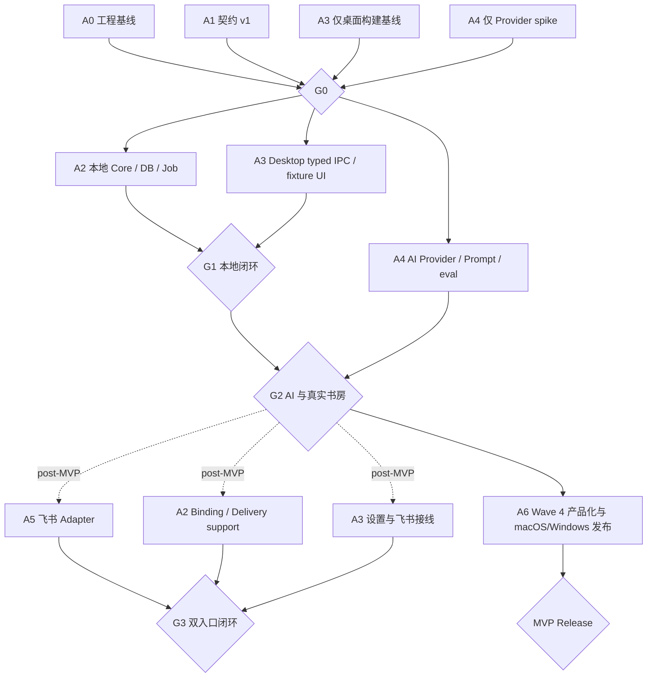

# Paopao MVP 多 Agent 施工计划

> 依据：[`README.md`](./README.md) 与 [`contracts.md`](./contracts.md)  
> 计划方式：1 个协调 Agent + 最多 3 个并行实现 Agent  
> 估算：5-7 周单人等效工作量；并行不能压缩 macOS/Windows 和可靠性验收的真实等待时间  
> 范围修订：2026-08-08，G3/M3 改为 MVP 后增量，不再阻塞 G4，见 [`ADR 0004`](../adr/0004-defer-feishu-post-mvp.md)

## 1. 施工策略

本项目不是从零开始：视觉和窗口壳可复用，但业务链路必须重新建立。实施顺序固定为：

```text
契约和构建基线
  -> 本地 Capture/SQLite/Job
  -> 真实书房和 FTS
  -> AI 抽取与带来源洞察
  -> 产品美化、交互硬化、安全、恢复和 macOS/Windows 发布

MVP 后可选：飞书长连接增量
```

任何阶段都遵循四个原则：

1. 先让失败可恢复，再增加新能力。
2. 下游先对共享 fixture 开发，不复制临时类型。
3. 一个目录同时只有一个写入负责人。
4. 每个 Gate 都必须有可重复的验收证据，不能只凭界面截图宣布完成。

## 2. 目标目录

M0 完成后，生产代码收敛为：

```text
paopao/
  package.json                 # npm workspaces 和统一命令
  package-lock.json
  packages/
    domain/
      src/
      test/
    contracts/
      src/
      fixtures/v1/
      test/
    core/
      src/services/
      src/ports/
      test/
    infrastructure/
      src/database/
      src/scheduler/
      src/ai/
      src/export/
      src/backup/
      src/logging/
      test/
  adapters/
    feishu/
      src/
      test/
  desktop-app/
    electron/
      bootstrap/
      ipc/
      security/
      windows/
      main.ts
      preload.ts
    src/
      renderer/
        pet/
        capture/
        library/
        settings/
      styles/
    test/
  tests/
    e2e/
    fixtures/
  docs/
    adr/
    runbooks/
```

`prototype/` 冻结为历史原型；`preview/` 继续使用隔离演示数据；`feishu-bot/` 在新 Adapter 验收后标为 legacy，不把其 JSONL/Self Model 迁入生产数据。

## 3. Agent 分工与文件所有权

| ID | Agent | 独占写入范围 | 主要交付 | 禁止事项 |
|---|---|---|---|---|
| A0 | Coordinator / Integrator | 根配置、lockfile、CI、发布配置、ADR 索引 | 分派、契约冻结、依赖变更、集成、Gate 结论 | 不在接口未冻结时派发消费者实现 |
| A1 | Domain / Contract | `packages/domain/**`、`packages/contracts/**`、契约 ADR | Zod Schema、领域状态机、fixtures、contract tests | 不实现 DB、UI、Provider 或飞书 |
| A2 | Core / Data | `packages/core/**`、`packages/infrastructure/src/{database,scheduler,export,backup,logging}/**` | Capture、Repository、SQLite、Job、FTS、纠正/删除/备份/导出/诊断、logger 实现 | 不依赖 Electron/飞书/具体 AI SDK |
| A3 | Desktop | `desktop-app/electron/**`、`desktop-app/src/**`、`desktop-app/test/**`、`desktop-app/vite.config.ts`、`desktop-app/tsconfig*.json`、`desktop-app/index.html`、`desktop-app/public/**` | 窗口生命周期、typed IPC、safeStorage、真实 UI、桌面构建路径 | Renderer 不碰 DB/Key 读取接口，不复制 Core 规则 |
| A4 | AI / Evaluation | `packages/infrastructure/src/ai/**`、`prompts/**`、`evals/**`、A0 指定的 Provider ADR 文件 | Provider、Prompt Registry、抽取/洞察验证、评测 | 不直接写 DB，不自动确认画像 |
| A5 | Feishu Adapter | `adapters/feishu/**` | 长连接、绑定、事件映射、去重回复状态、重连 | 不维护第二套记忆库，不启动生产 HTTP 回调 |
| A6 | QA / Release | `tests/**`、`docs/runbooks/**`、验收报告 | 集成/E2E/隐私、截图采样、渲染/交互、macOS/Windows 工程检查与发布清单 | 不绕过业务接口修补测试数据 |

共享文件规则：

- 只有 A0 修改根及各 workspace 的 `package.json`、lockfile、`packages/infrastructure/src/index.ts`、CI 和 electron-builder 配置；每个包的其他源码入口归该包 owner。M0 预先建立稳定 subpath exports，A2/A4 不争用 Infrastructure 包入口。
- 只有 A1 修改已冻结 Schema；其他 Agent 提交 Contract Change Proposal。
- 只有 A2 新增或修改数据库 migration；已合入的 migration 不回写，改动必须新增版本。
- 只有 A3 修改 `main.ts`、`preload.ts` 和 Renderer 全局声明。
- A5 完成 Adapter 后，由 A3 在 bootstrap 的预留 composition hook 中接线。
- A6 需要增加测试依赖或 CI job 时先给 A0 一个最小变更清单。
- Agent 不执行 `git switch`、`git reset`、全仓格式化或无关重构；共享工作区内不得覆盖其他人的未提交改动。

## 4. 依赖图与并行波次



推荐调度：

| Wave | 并行 Agent | 前置 | 结束条件 |
|---|---|---|---|
| 0 | A0、A1、A3（仅 M0-03）、A4（仅 Provider spike） | 无 | 构建/CI 骨架、Provider ADR 和 contracts v1 冻结 |
| 1 | A2、A3、A4 | G0 | 本地文字闭环；AI Adapter 可用；UI 可基于 fixture 联调 |
| 2 | A2、A3、A4 | G1 | AI 派生、洞察、真实书房、纠正/删除/导出完成 |
| 3（MVP 后增量） | A5、A3、A2 | G2 | 飞书复用 Capture，绑定/幂等/重连通过；不阻塞 MVP |
| 4 | A0、A3、A6 + 缺陷所属 Agent | G2 | 渲染/交互工程检查完成，当前候选已有人工美术指导，macOS/Windows 干净机、文档和安装包通过 |

最多并行 3 个实现 Agent。Coordinator 持续运行但不抢占业务目录。

## 5. Gate 定义

### G0：契约与工程基线

进入条件：当前仓库基线已盘点。  
退出条件：

- 根 workspace、lockfile、Node/npm 版本和统一 scripts 已提交。
- `@paopao/domain`、`@paopao/contracts` 可独立 typecheck/test/build。
- Capture、Entry、Job、AI 输出、IPC、事件和错误码 fixtures 已冻结。
- Backup restore、diagnostics export、控制事件 claim 和 ExternalDelivery retry/issue fixtures 已冻结。
- Renderer/Electron build 在没有业务实现时也能通过。
- Vite `base`、托盘/静态资源和 Electron `noEmit` 问题已修复。
- CI 已执行 `npm ci -> typecheck -> contract/unit test -> renderer/main build -> Windows/macOS native-module and package smoke`，不是后补任务。
- Provider ADR 已冻结本期唯一 Provider、默认模型、认证、结构化输出和输入上限。

### G1：本地可靠记录

退出条件：

- 桌面文字在一个事务写 Entry + revision + Job。
- 成功 UI 只在事务提交后清空输入；失败时输入保留。
- Worker 支持 claim、租约、退避、启动恢复和 fake Provider。
- 列表、详情和原文 FTS 都来自 SQLite。
- 断网/强退/重启集成测试不丢 `stored` 原文。
- 启动备份、迁移前备份和从最近有效备份恢复到隔离目录的测试通过。
- 设置页只以内部 backupId 发起恢复，恢复失败可回滚且 DB 关闭期间仍能查询 journal 状态。

### G2：AI 与可治理记忆

退出条件：

- 多个命名 Provider Profile 通过设置页的 write-only IPC 配置，任一时刻只激活一个；Key 不可从 Renderer 读回，也不进入 SQLite/日志。Direct 与 Codex 渠道的详细边界见 ADR 0005。
- 中立抽取输出经过 Schema 校验和一次修复，派生结果/来源/AI Run 落盘。
- `think` 模式生成带 citation 的洞察；无历史来源时明确 `no_relevant_memory`。该能力是 G2/P0，不是可跳过优化。
- 搜索覆盖当前文本和最新派生内容。
- 分类/摘要纠正、正文 revision、重跑、删除、导出通过。
- `export.get`、脱敏诊断导出和备份恢复 UI 通过 typed IPC 接入，没有任意路径输入。
- 书房没有硬编码数据，所有空/错/加载/离线状态可见。

### G3：桌面与飞书双入口（MVP 后增量 Gate）

G3 不再是 G4 的进入条件。以下退出条件只用于未来正式发布飞书连接器：

退出条件：

- 飞书凭据本地安全保存，长连接状态可见。
- 一次性绑定码过期、重复消费和暴力尝试测试通过。
- 飞书文本调用同一个 CaptureService。
- 同一事件/消息的自动重复投递与恢复不会重复 Entry 或回复；用户风险确认后的 `retry_once` 例外有独立验收。
- 控制消息先 claim 再执行；回复 retry_wait 可周期恢复，ambiguous/failed_final 可在设置页诊断和人工处理。
- 休眠恢复、断线重连、权限不足和未绑定状态可诊断。
- 应用关闭时明确离线，没有 HTTP 服务或云端第二数据库。

### G4：可发布 MVP

退出条件：

- 所有自动化门禁通过。
- Windows 10/11 x64 与 macOS 12+ x64/arm64 干净机冒烟通过。
- 安装包、SHA-256、版本、迁移说明和已知限制齐全。
- README 只描述真实已实现能力。
- 产品负责人按 `docs/mvp/README.md` 的 S1-S3 与 S5 签收。

## 6. 详细工作包

每个工作包完成时必须附带代码、测试、命令结果和 handoff。MVP 工作包的 `P0` 阻塞后续 Gate，`P1` 阻塞 MVP Release，`P2` 只记录。M3 的优先级只适用于未来连接器增量，不阻塞 G4。

### M0 契约与构建基线

#### M0-01 Workspace 和依赖基线（A0，P0）

施工：

1. 创建根 npm workspace，纳入 `desktop-app`、`packages/*`、`adapters/*`。
2. 固定 Node LTS、npm 和 Electron 版本；生成唯一根 lockfile。
3. 建立统一命令：`typecheck`、`test`、`build`、`dist:win`、分包命令。
4. 清理 MVP 明确不使用的生产依赖，或在 ADR 中说明保留原因；Supabase 不得进入运行路径。
5. 配置原生模块的 Electron rebuild 和 Windows CI 缓存。

验收：全新 clone 后只需要 `npm ci`；不允许每个子目录各装一份漂移依赖。

#### M0-02 Contract v1（A1，P0）

施工：

1. 按 `contracts.md` 建 Zod Schema，TypeScript 类型从 Schema 推导。
2. 实现领域值对象、状态迁移守卫和稳定错误类型。
3. 建 valid/invalid fixtures 与 round-trip contract tests，覆盖 backup/diagnostics、控制事件 claim、delivery retry/issue 和 `export.get`。
4. 为旧字段写一次性映射 ADR，但生产代码不支持两套字段。

验收：非法字段、越权 source、超长文本、非法状态迁移均被拒绝；fixtures 可被 A2/A3/A4/A5 直接导入。

#### M0-03 Electron 构建和资源（A0 + A3，P0，G0 前特许）

施工：

1. 修复 Electron `tsconfig` 继承 `noEmit` 的问题和输出入口。
2. Vite `base` 设为打包可用的相对路径并验证 `file://` 加载。
3. 添加真正适合作为 Tray 的图标资源；背景图不能作为 Tray 图标。
4. 确保所有 runtime 资源进入 electron-builder `files/resources`。
5. 按 `docs/adr/0003-preload-sandbox-bundle.md` 把 preload 建成只外置 `electron` 的单文件 CJS；构建时拒绝 Node built-in 和多余 external，不生成 ESM preload。
6. 所有窗口复用显式 `sandbox: true`、`contextIsolation: true`、`nodeIntegration: false`、`webviewTag: false`、`webSecurity: true`，并添加 CSP 和导航拦截。

边界：A0 修改 package manifest/electron-builder；A3 修改 `electron/**`、`vite.config.ts`、`tsconfig*.json`、`index.html`、`public/**` 和 Renderer 资源引用。A3 在 G0 前只执行本工作包，不提前做 M1 UI。

验收：Renderer/Main build、开发启动和未签名 Windows 包的静态资源路径检查通过；`preload.cjs` 存在、`preload.js` 不存在；真实 Electron smoke 证明 `window.paopao`、typed IPC 和 Renderer 隔离，build-only 不算通过。

#### M0-04 CI 骨架（A0，P0）

流水线至少包含：

```text
npm ci
  -> format/lint check
  -> typecheck
  -> contract/unit tests
  -> renderer build
  -> electron build
  -> windows native-module smoke
```

此时不要求业务 E2E 通过，但 CI 本身必须通过，job 和报告位置必须预留。

#### M0-05 单 Provider 能力 Spike（A4 + A0/A1，P0，G0 前特许）

A4 只做最小只读/隔离实验和 ADR，不进入完整 M2 实现。ADR 必须冻结本期唯一 Provider ID、默认模型、认证方式、结构化 JSON 能力、最大输入、timeout/429/safety 错误映射、成本审计字段和 CI fake 策略。A0 处理依赖，A1 据此把设置与 Provider Schema 收紧为 allowlist。

### M1 本地文字闭环

#### M1-01 SQLite 初始化、迁移与备份（A2，P0）

施工：

1. 数据库路径使用 `app.getPath("userData")/db/paopao.sqlite`，通过 bootstrap 参数注入 Infrastructure；数据库包本身不导入 Electron。
2. 实现 migration runner、`schema_migrations`、启动/迁移前备份、7 份保留、带内部 backupId 的 SHA-256 manifest、数据库外 restore journal、隔离恢复和失败自动回滚。
3. 启用 foreign key、secure_delete、WAL、busy timeout；启动时验证 FTS5 trigram。
4. 实现临时数据库 factory，测试不得写开发者真实 `userData`。
5. 创建 `001_initial.sql` 全部表和索引。

验收：空库迁移、重复启动、24 小时备份策略、旧版本升级、失败 migration 回滚、未知 backupId/损坏备份检测、替换失败回滚、回滚失败维持 unavailable、崩溃 journal 恢复和隔离恢复测试通过。

#### M1-02 CaptureService（A2，P0）

施工：

1. 校验 Core 命令，不信任调用方已经校验。
2. 原样保存 rawText，trim 只用于判空；单事务写 `entries`、revision 1 和 `analyze_entry` Job。可选飞书增量启用时，才在同一事务追加 event -> canonical message -> Entry 账本。
3. 使用 `source_key` 和 Job key 实现持久化幂等。
4. 提交后发布 `entry:stored`；事务失败不发布事件。
5. 提供 injectable clock、ID generator 和 event publisher，保证测试确定性。

验收：同 requestId 返回同一 Entry；相同内容不同 requestId 产生两条；事务中任一步失败时零条半成品。

#### M1-03 Worker 和 Job 状态机（A2，P0）

施工：

1. 实现轮询、原子 claim、lease owner、递增 fencing token、lease renewal 和 graceful shutdown。
2. 实现可注入 jitter 的退避、最大尝试数和错误分类。
3. 网络/配置不可用进入 waiting 状态且不消耗 attempt；联网/保存配置事件重排。启动时恢复过期 running Job；系统唤醒后立即补一次扫描。
4. 先接 FakeAiProvider，fixture 的成功、限流、超时和非法输出都可复现。
5. Job/Entry 状态变更后发布领域事件。

验收：两个 Worker 竞争不能重复 claim；丢失 lease/fencing 的晚结果不能提交；强杀后恢复；离线等待不耗尽次数；成功提交重复运行不产生新 revision。

#### M1-04 原文查询和 FTS（A2，P0）

施工：

1. 实现 cursor 列表、详情 DTO 和书架分类 count query。
2. 原文 revision 1 入 trigram FTS；派生字段暂为空；1-2 个 CJK code points 走参数化 LIKE fallback。
3. 查询转义和长度限制放 Repository；不拼接用户 SQL。
4. 分页排序稳定，删除态默认排除。

验收：中文、英文、精确短语、空结果、分页边界和特殊字符测试通过；查询 P95 在 10k 本地记录样本下有基准数据。

#### M1-05 typed IPC 和 Capture UI（A3，P0）

施工：

1. preload 使用 v1 语义 API，所有输入/输出过 Zod。
2. Main 建 composition root，注入 Core service，不把数据库对象返回 Renderer。
3. Capture UI 生成 requestId；提交中禁重复按钮；只有 `ok && status=stored` 才清空输入。
4. 展示 `saving/stored/processing/retry_wait/ready/failed_final`；保存失败保留文本。
5. 事件订阅返回 unsubscribe，React effect 正确清理。

验收：缺少 preload、IPC validation error、DB error 和重复点击均不会显示假成功或清空用户文字。

#### M1-06 真实书房骨架（A3，P0）

施工：

1. 删除硬编码 count 和详情，接 `entry.list/get`。
2. 实现空、加载、错误、离线、处理中和最终失败状态。
3. 书脊只显示 MVP 分类，不显示日报/周报假数据；后续分类可显示禁用说明或直接隐藏。
4. 搜索使用 250ms debounce 和请求序列保护，旧响应不能覆盖新查询。
5. 详情始终先显示原文，再显示派生结果和来源。

验收：fixture 和真实 DB 两种模式的视觉状态一致；长文本不溢出；键盘可操作。

#### M1-07 备份恢复入口（A2 + A3，P0）

施工：

1. A2 实现 `BackupService.list/restore/status`，只接受 manifest 中的内部 backupId；restore journal 位于数据库外，DB 关闭期间仍可查询。Restore 不写入将被替换的 Job 表，由 Main 启动单实例串行 task，并在启动时按 journal 恢复/回滚。
2. A3 实现 typed IPC 和设置页列表/二次确认/进度/成功/回滚失败状态；Renderer 不提交路径，也不把领域事件当完成依据。
3. A3 实现 `RestoreLifecyclePort`：先拒绝写入并停止外部 intake，再 drain Worker；A2 校验、快照、关闭、替换、重开数据库；成功后先 Worker 后 Adapter。失败按契约回滚，原库也无法重开时保持 unavailable。
4. 启动发现未完成 journal 时先完成恢复或回滚，再开放 Capture/Worker/Adapter。

验收：未知/损坏备份不触碰当前库；有效恢复后列表和 FTS 一致；替换失败恢复原库；恢复中 Capture 明确失败且不显示假成功；重启可恢复中断 journal。

### M2 AI、洞察和数据治理

#### M2-01 Credential Store 与设置（A3，P0）

施工：

1. 封装 `safeStorage`，读取面只暴露 isConfigured；save/delete 通过专用 Main 命令执行。
2. 设置页通过 write-only IPC 提交 Provider、模型和 Key；提交完成立即清空组件 state，Key 不回显，只显示配置状态。
3. 生产环境加密能力不可用时 fail closed。
4. Provider factory 只在 Main/Infrastructure 接收解密后的瞬时值。

验收：除用户输入和单次 write-only IPC 的瞬时内存外，Renderer 无读取 Key 的 API；SQLite、导出、日志和事件中搜索不到测试 Key；删除配置后 Provider/Token 内存对象失效。

#### M2-02 Prompt Registry 和真实 Provider（A4，P0）

施工：

1. 抽取 Prompt 使用中立事实语言；人格 Prompt 只用于洞察回复。
2. Prompt 以文件 + semantic version 注册；调用写 `promptVersion`。
3. 按 G0 Provider ADR 实现 `@paopao/contracts` 的 `AiProviderV1`；抽取和洞察都走结构化生成，统一 offline/timeout/auth/429/5xx/safety/invalid output 错误。
4. 用户文字包在明确的不可信数据段，不能改变系统规则。
5. 普通日志只记录审计元数据。

验收：Fake 和真实 Provider 共用端口；错误映射稳定；Prompt injection fixtures 不产生副作用。

#### M2-03 分析流水线（A2 + A4，P0）

明确交界：A1 冻结 `AiProviderV1`；A2 写 ProcessingService 和事务；A4 只实现 Provider/Prompt/validation adapter，不另建端口。

施工：

1. Worker 读取当前 text revision 后结束事务。
2. 调用结构化抽取；失败时最多一次修复。
3. 验证 classification/summary 和每个项目的 evidence 是当前文本子串；不合法输出进入 review。
4. 短事务 append AI Run/各 kind derivation，切换 current Memory/Source/FTS 和状态。
5. 提交时检查 job fencing、Entry 非删除态和 text revision；旧结果不成为当前读模型或复活已删数据。

验收：Provider 成功/超时/429/无效 JSON/修复成功/修复失败/并发正文编辑全部有集成测试。

#### M2-04 带来源洞察（A2 + A4，P0）

施工：

1. `remember` 在结构化整理后结束，不生成教练话术。
2. `think` 在分析提交的同一事务创建 `generate_insight` Job，payload 固定 `{entryId, textRevision, analysisDerivationId}`。
3. RetrievalService 用 FTS5 召回，排除当前 Entry 和非 ready/deleting/purged 记录，最多取 8 条。
4. A4 返回结构化 `InsightReplyV1`；citation 的 memoryId/entryId/evidenceQuote 三元组必须与本次召回完全相等。
5. 没有相关结果时明确 `no_relevant_memory`，仍可基于当前输入给一个克制的下一步。
6. 洞察存为 derivation 并绑定来源，UI 异步显示。

验收：grounded 至少一个合法 citation，no_relevant_memory 零 citation；崩溃不会漏建洞察 Job；revision race 不提交旧洞察；洞察失败不回滚分析结果或改变 Entry ready。

#### M2-05 纠正、revision 和重跑（A2 + A3，P0）

施工：

1. 正文编辑创建 revision 并排新的 analyze Job。
2. 分类、摘要、实体、目标或行动纠正创建 `created_by=user` derivation。
3. 正文用 `expectedTextRevision`、派生纠正用 `expectedDerivationId` 防止旧窗口覆盖新数据。
4. 只改派生内容时同步更新 Memory/FTS，不调用模型。
5. 手动 retry 只开放给允许状态，并展示稳定错误码。

验收：并发纠正冲突、纠正后搜索、旧 AI Job 晚到、重跑幂等测试通过。

#### M2-06 删除与导出（A2 + A3，P0）

施工：

1. 删除二次确认；短事务隐藏记录、取消未运行的 AI Job 并创建 purge Job；在途结果靠 fencing + 删除态检查拒绝。
2. purge 清除所有内容、append-only 派生、来源、FTS 和关联审计正文，只留无内容墓碑。
3. purge 启用 secure_delete，截断 WAL，删除可能包含该记录的应用自动备份并生成净化后备份。
4. 导出在固定 `userData/exports` 下用临时目录生成，完成后原子 rename；`ExportService.create/get` 都按冻结 DTO 实现，状态查询不绕过 Core。
5. manifest 保存 schema/app 版本、创建时间、文件列表和 SHA-256。
6. 导出设置页展示完成路径，但 Renderer 不能指定任意写入路径；旧导出是独立快照，删除确认明确提示不会改写用户已复制的副本。

验收：删除后当前 SQL/FTS/WAL/自动备份/新导出/诊断包都找不到测试原文；导出校验和和重复执行测试通过。

#### M2-07 AI 评测门禁（A4，P1）

施工：

1. 仓库提交至少 30 条合成或不可逆匿名化 must-pass fixtures，覆盖分类、旧类型到主分类映射、证据、无关文本、恶意指令、检索 query->gold Entry 和空数组；报告不回显正文。
2. 100 条匿名金标是 MVP 后公开扩测目标，不阻塞本期 G4；不得使用真实用户/飞书原文凑样本。
3. 输出 Schema 首次/修复后通过率、主分类 F1、证据可定位率、citation 合法率、FTS Recall@8/空结果误报率和人格回复 rubric。
4. 硬门禁：证据引用可定位率 100%、非法 citation 0、`Recall@8 >= 0.80`、无相关结果 query 误报率 `<= 5%`、自动 confirmed 画像 0、Prompt 触发副作用 0；少于 30 条 fixture 视为失败。

建议目标：修复后 Schema 通过率 >=99%，主分类 macro-F1 >=0.90，证据 precision >=0.90。

### M3 飞书在线适配（MVP 后增量，暂停正式验收）

M3-01 至 M3-03 的现有实现和自动化测试保留为增量基线；不继续扩大功能面。M3-04 真实租户验收延期，不阻塞 G4。

#### M3-01 Adapter 连接与凭据（A5 + A3，increment P0）

施工：

1. A5 使用官方 SDK 建立长连接，不复用旧 HTTP server。
2. A3 提供安全凭据 facade，并作为唯一 composition root 调用 `createFeishuAdapter({ credentialProvider, captureService, bindingService, deliveryService, publicSettingsProvider, subscribeDomainEvents, logger, clock })`；A5 不导入 Electron。
3. 连接状态通过领域事件进入设置页。
4. 实现显式 connect/disconnect、断线退避、Token 刷新和系统唤醒检查。

验收：Key/Secret 不进日志；错误凭据、权限不足、网络断开和重新连接均给稳定状态。

#### M3-02 一次性绑定（A2 + A5 + A3，increment P0）

施工：

1. A2 实现 BindingService、Repository 和事务：生成 6 位绑定码，默认 10 分钟有效，数据库只保存 salted hash。
2. A2 保证验证、消费、绑定在一个事务，并实现失败限速和单 active 绑定约束。
3. A3 通过窄 IPC 在设置页展示一次性明文码，之后不能从数据库回显。
4. A5 对 `/bind`、`/unbind`、未绑定/帮助/群聊/非文本提示先调用 `claimControlEvent`；只有 `process` 才以 `control:<messageKey>:<kind>` 调幂等 BindingService，再用 fencing 完成控制账本并推进 message-level ack。命令不进入记忆，未绑定用户的普通消息不落库。

验收：过期、重复消费、错误码、并发消费、解绑和重新绑定测试通过；相同 event、不同 event/相同 message、claim 后崩溃重放都不重复执行控制动作或回复。

#### M3-03 消息幂等与回复（A5 + A2，increment P0）

施工：

1. event key 只登记 received event；message key 生成 Capture `sourceKey` 和唯一 external message/delivery 账本，同一 message 的不同 event 关联同一账本。
2. 普通文本转换为内部 CaptureCommand，调用同一个 CaptureService。
3. 只支持飞书 p2p 文本；群聊/非文本明确提示限制，不写占位 Entry。
4. Capture 提交后，通过 `ExternalDeliveryService` 按 `messageKey+ack` claim 再发送保存确认。
5. `external_messages` 跟踪 ack/result 的 waiting/pending/sending/retry_wait/sent/sent_assumed/ambiguous/failed_final，以及每 phase owner/lease/fencing/attempts/manual-retry-used；Insight 提交/失败事务推进 result。Adapter 在启动/重连/控制完成/insight:ready 和连接期间每 15 秒 single-flight 扫描，每轮先 recover stale claims，再查询持久化 due delivery。
6. 明确未发送的临时失败按 `5s/30s/2m/10m` 持久化退避，最多 5 次；发送结果未知或无幂等键的 stale sending 进入 ambiguous，不自动重发。
7. 设置页只读列出 ambiguous/failed_final；用户可以标记 assume_sent，或在 `RETRY_MAY_DUPLICATE` 明确确认后对每 phase 最多 retry_once 一次。历史 attempts 保留，人工失败不回自动退避；操作复用 requestId 并递增 fencing 使旧发送者失效，不展示正文或收件人 ID。
8. `listDue` 只返回候选引用；`claimReply` 在同一事务绑定 phase token、recipient 和实际 payload。Insight 提交时固定 `result_derivation_id` 快照，A5 不发送 claim 之前缓存的内容。

通道策略冻结为：飞书默认 `ack_only/remember`；用户在设置中切换 `insight` 后才用 `think`，并在 `generate_insight` 成功后发送一次带来源最终结果。

验收：同 event ID、不同 event ID/同 message ID、回复前断线、连接未重建但事件丢失、重启漏事件、外部发送结果不确定等自动路径故障注入均不重复建档/回复；retry_wait 可由周期扫描恢复，模糊 `*_sending` 不自动重发；旧 fencing 的完成/失败不能覆盖新 attempt，list/claim 间 revision 变化也不能发送非 claim 快照；人工 `retry_once` 必须经过风险确认、每 phase 只授予一个 claim，并允许测试观测到已披露的重复可能。

#### M3-04 飞书人工租户验收（A5 + A6，post-MVP）

记录：创建企业自建应用、所需权限、事件订阅、发布范围、连接截图、绑定、文字输入、断线/休眠恢复和解绑。凭据不得出现在截图或报告。

### M4 产品化、可靠性、安全与发布

#### M4-00 候选画面迭代与窗口交互硬化（A3 + A6，P0，G2 后优先）

施工与发布边界见 [`wave4-product-release.md`](./wave4-product-release.md)。工程文档不提供风格、构图或素材权威。

1. A6 记录候选 commit SHA、运行环境和截图矩阵；SHA 只负责复现候选，不是视觉目标。
2. 程序采集 quiet、listening、thinking、insight 及活书房主要数据状态的原始截图，并检查透明通道、空帧、资源加载、裁切和 DPR 等工程事实。
3. 每轮截图交给人工美术评审。评审必须输出当前画面问题、判断依据、保留项和下一轮具体指导，不输出美术 PASS/FAIL；目标只来自本轮用户提供或确认的参考。
4. 审阅三窗口移动区域和控件命中：泡泡主体可拖动，快速记录 header 和书房可移动区域不吞掉按钮、输入或滚动内容。
5. 泡泡点击实现互斥状态机：单击延迟、双击取消单击、拖动不产生 click；事件序列需要单测或 Electron E2E 证据。

工程出口：A6 输出截图路径、采样环境、渲染/交互检查结果和残余风险。美术迭代依据人工指导继续推进，不能通过调阈值或让软件 Gate 变绿来结束。

#### M4-01 单元与集成测试（A6，P0）

必须覆盖：

- Schema、状态机、幂等键和错误映射。
- migration、事务回滚、备份恢复、FTS 和 purge。
- Worker 双实例竞争、fencing、强杀恢复、waiting/resume、退避和手动重跑。
- Provider timeout/429/invalid JSON/revision race。
- 已存在的飞书控制、绑定和 delivery 测试继续作为回归覆盖，但不要求真实租户证据关闭 MVP。
- 用户导出/诊断导出 manifest、`export.get` 和隐私字段缺失。
- 备份 backupId 边界、隔离校验、替换回滚、journal 崩溃恢复和数据库重开顺序。

#### M4-02 Electron E2E 与安全（A6 + A3，P0）

必须覆盖：

- 快捷键、托盘、单击/双击判定和窗口恢复。
- 三窗口拖动区域、no-drag 控件、焦点、关闭/返回和滚动交互；泡泡拖动不能误触发单击。
- 泡泡透明边缘、Canvas alpha、DPR 和活书房固定状态的截图采样；这些截图不产生美术结论。
- 保存成功/失败不丢输入、离线、重启、搜索、详情、纠正、删除、导出、备份恢复和诊断导出。
- 事件监听清理，窗口重开不重复响应。
- Renderer 无 Node、DB、任意文件、原始 IPC 和密钥读取访问；只允许测试专用 write-only 提交。
- ADR 0003 runtime smoke 在 Linux Xvfb、Windows 与 macOS 执行，监听 `preload-error`，断言有效 webPreferences，并至少完成一次 typed IPC 往返。
- CSP、导航拦截和外部链接策略。
- 长标题、长原文、空数据、加载和错误状态无布局破坏。

#### M4-03 诊断和脱敏（A2 + A3，A2 owner；A6 验证，P0）

施工：

1. A2 建立统一 logger 实现和 correlation ID；A3/A4/A5 只消费 logger port，不并行修改 logging 目录。
2. A2 实现 `DiagnosticsService.createExport/getExport`、`create_diagnostics_export` Job 和固定 `userData/diagnostics` 原子目录；输出仅含 manifest、脱敏环境/状态计数、白名单事件和二次 hash 的 delivery issues。
3. A3 接 typed IPC 和设置页创建/轮询/完成/失败状态；Renderer 只传 1-7 天窗口，不传路径或内容。
4. A6 用合成 canary secret/raw text 跑完整流程，然后扫描数据库预期位置之外的日志、用户导出、诊断包、crash dump 配置和测试 artifact；任何泄漏阻塞发布。

验收：诊断包能定位 correlation ID、Job/飞书状态和版本，但不含数据库副本、原文、派生正文、搜索词、Prompt、quote、收件人或 Secret；canary 扫描和损坏临时目录清理通过。

#### M4-04 macOS/Windows 打包和干净机（A0 + A6，P0）

在 `windows-latest` 构建 x64 NSIS，在 `macos-latest` 构建 macOS x64/arm64 DMG/ZIP；
验证 `better-sqlite3` ABI、安装资源、签名/notarization 状态和卸载策略。在干净
Windows 10/11 x64 与 macOS 12+ x64/arm64 环境依次执行：

1. 安装和首次迁移。
2. 托盘、全局快捷键、泡泡、Capture 和书房。
3. 保存、断网、强退、重启和恢复处理。
4. 搜索、纠正、删除、用户/诊断导出，以及从有效自动备份恢复、损坏备份拒绝和替换失败回滚。
5. 升级一个带 migration 的测试版本。
6. 卸载，确认用户数据保留策略与文案一致。
7. Mac 额外验证透明窗口、权限提示、Command 快捷键和 Intel/Apple Silicon 架构；
   Windows 额外验证托盘、全局快捷键和 NSIS 卸载行为。

#### M4-05 发布文档（A0 + A6，P1）

更新 README 的已实现/规划状态，输出：版本、平台/架构、安装包 SHA-256、签名/notarization
状态、数据库版本、迁移/备份恢复/回滚说明、已知限制、数据目录、用户/诊断导出与删除
说明和截图/渲染/交互工程报告。飞书 runbook 归档为 post-MVP 增量材料。

## 7. 测试命令基线

M0 由 A0 把这些稳定成根 scripts：

```bash
npm ci
npm run typecheck
npm run test:contracts
npm run test:unit
npm run test:integration
npm run build
```

Windows CI/验收机额外执行：

```powershell
npm.cmd run test:e2e
npm.cmd run dist:win
npm.cmd run smoke:installed
```

macOS CI/验收机额外执行：

```bash
npm run test:e2e
npm run dist:mac
npm run smoke:preload:runtime
```

飞书真实租户验收延期到 MVP 后增量，不能把真实 Secret 放进 CI。AI 单元/集成测试默认使用 Fake Provider；真实 Provider 只在受控 eval job 中调用。

## 8. 验收矩阵

| 需求 | 自动化证据 | 人工证据 | Owner |
|---|---|---|---|
| 原文先存 | Capture 事务集成测试 | 断网保存演示 | A2/A6 |
| 300ms 保存确认 | 提交到 UI stored 的 E2E P95 + 事务分段指标 | Windows/macOS 参考机记录 | A2/A3/A6 |
| 强退恢复 | Worker 恢复测试 | Task Manager 强退 | A2/A6 |
| AI 输出稳定 | fixtures/eval 报告 | 失败状态审阅 | A4 |
| 来源可追溯 | source/citation tests | 详情展开来源 | A2/A3 |
| 搜索真实 | FTS 集成测试 | 书房搜索 | A2/A3 |
| 纠正不覆盖 | revision conflict tests | 双窗口操作 | A2/A3 |
| 删除完整 | canary purge scan | 设置页确认 | A2/A6 |
| 导出可校验 | manifest tests | 新目录打开 | A2/A6 |
| 诊断不泄漏 | diagnostics canary scan | 设置页生成诊断包 | A2/A3/A6 |
| 备份可回滚 | restore/journal 故障注入 | 设置页从内部 backupId 恢复 | A2/A3/A6 |
| 飞书增量回归（非 MVP Gate） | capture/control event replay + delivery recovery tests | MVP 后真实租户验收 | A2/A3/A5/A6 |
| Renderer 隔离 | security E2E | DevTools 尝试 | A3/A6 |
| 泡泡无黑边 | Canvas alpha/边缘像素检查 | macOS/Windows 截图审核 | A3/A6 |
| 窗口交互 | drag/click/double-click E2E | 三窗移动和控件命中记录 | A3/A6 |
| 活书房候选画面 | 固定状态截图与渲染完整性数据 | 人工评审的问题清单和下一轮美术指导 | A3/A6/评审方 |
| Windows 可安装 | NSIS CI artifact | Windows 10/11 干净机报告 | A0/A6 |
| macOS 可安装 | DMG/ZIP CI artifact | macOS x64/arm64 干净机报告 | A0/A6 |

## 9. 集成规则

### 9.1 开始工作前

每个 Agent 必须：

1. 读 `docs/mvp/README.md`、本文件和 `contracts.md`。
2. 查看 `git status`，记录已有用户改动。
3. 声明本轮 owned paths、输入契约和退出条件。
4. 先运行自己模块当前测试，记录基线失败。
5. 确认没有另一个 Agent 正在写相同目录。

### 9.2 依赖变更

业务 Agent 不直接改任何 package manifest/lockfile。提交给 A0：包名、精确版本、用途、是否 production dependency、原生模块影响和替代方案。A0 集中安装并回跑全量门禁。

### 9.3 Contract Change Proposal

```text
CCP-ID:
提出 Agent:
当前契约:
建议变化:
业务原因:
受影响消费者:
兼容/迁移策略:
新增 fixtures/tests:
不采纳时的替代实现:
```

A1 批准并修改 Schema 后，下游才能消费。紧急 bug 也不能在消费者里加“临时字段”。

### 9.4 Handoff 模板

```text
Work package:
Status: done | partial | blocked
Owned paths:
Changed files:
Contract version consumed:
Contract changes: none | CCP-ID
Database migrations: none | version + rollback notes
Prompt versions: none | versions
Commands run and results:
Fixtures added/used:
Manual checks:
Known failures and residual risks:
Next owner and exact next action:
```

没有命令结果或 known failures 的 handoff 视为未完成。

## 10. 风险登记

| 风险 | 触发信号 | 处理 | Owner |
|---|---|---|---|
| 范围膨胀 | 出现多模态、报告、同步代码 | 停止合入，回到总纲范围 | A0 |
| Contract 漂移 | 同义字段在两个包中定义 | A1 统一，消费者删除复制类型 | A1 |
| 原生模块 ABI | 打包后加载 SQLite 失败 | 固定 Electron/Node，Windows rebuild + smoke | A0/A2 |
| 假保存 | UI 清空但 DB 无 Entry | 只认 CaptureReceipt；故障注入测试 | A2/A3 |
| Job 重复执行 | 重启产生重复 derivation | Job/提交幂等键 + revision check | A2 |
| AI 事实改写 | 抽取被人格 Prompt 美化 | 中立抽取与回复 Prompt 分离 | A4 |
| Prompt injection | 用户文本改变系统规则 | 不可信数据边界 + must-pass fixtures | A4 |
| 飞书增量代码回归 | 重连/重放出现两条消息 | 保留自动化测试；正式产品化前执行真实租户验收 | A5 |
| Secret 泄漏 | 日志/导出出现 canary | fail closed、脱敏扫描、发布阻断 | A3/A6 |
| 平台假代 | 单个平台 build 通过但另一平台安装失败 | macOS/Windows CI 与干净机均为门禁 | A0/A6 |
| 画面迭代失焦 | 把旧候选、文档或测试阈值当成目标 | 固定状态截图；人工评审每轮输出新的美术指导 | A3/A6/评审方 |
| 点击竞争 | 双击触发单击或拖动误提交 | 互斥状态机、事件序列 E2E | A3/A6 |
| 用户文档过度承诺 | README 写入未实现能力 | 发布前能力对账 | A0 |

## 11. 明确延期的 P2 Backlog

以下只记录，不创建代码占位或 UI 开关：

- 链接抓取、语音、图片、PDF/DOCX 和附件生命周期。
- Embedding/向量检索。
- 日报、周报、主动提醒和免打扰。
- Self Model 确认/拒绝/合并工作流。
- 云同步、数据库内容加密、多设备、多用户。
- 飞书正式连接器、真实租户验收、离线代收、OAuth、应用市场分发、日历/文档/通讯录。
- 代码签名、自动更新和多 Provider 管理。
- 将 AI 评测集从 MVP 的 30 条 must-pass 扩展到至少 100 条匿名金标。
